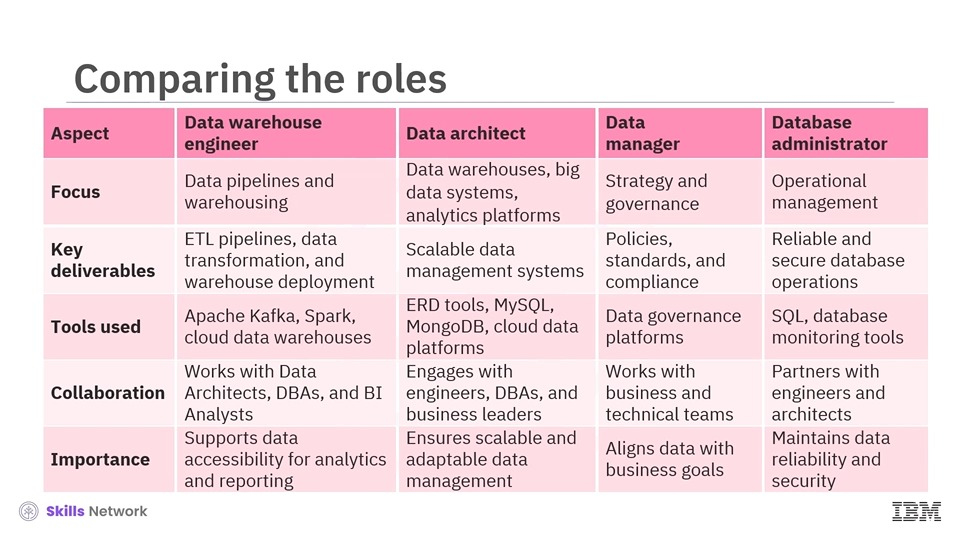
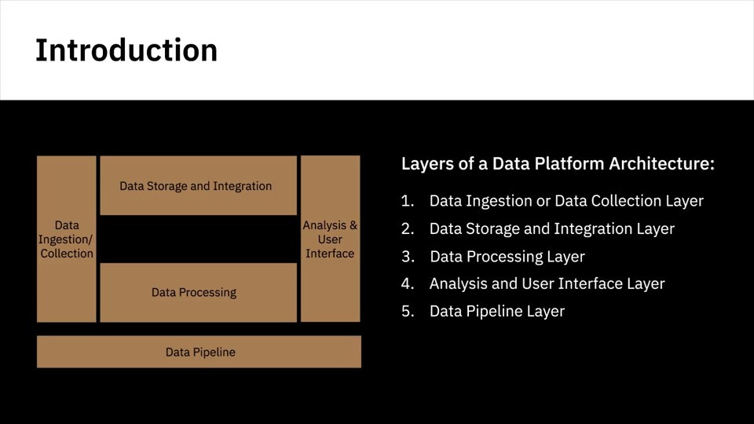

# Introduction to Data Engineering

## Modern Data Ecosystem
A modern data ecosystem includes a whole network of interconnected, independent, and continually evolving entities. It includes data that has to be integrated from disparate sources; different types of analysis and skills to generate insights; active stakeholders to collaborate and act on insights generated; tools, applications, and infrastructure to store, process, and disseminate data as required. 

A data engineer’s ecosystem includes the infrastructure, tools, frameworks, and processes for extracting data from disparate sources, architecting and managing data pipelines for transformation, integration, and storage of data, architecting and managing data repositories, automating and optimizing workflows and flow of data between systems; and developing applications needed through the data engineering workflow.

### Data Sources
Data is available in a variety of structured and unstructured datasets, residing in text, images, videos, clickstreams, user conversations, social media platforms, the Internet of Things (or IoT) devices, real-time events that stream data, legacy databases, and data sourced from professional data providers and agencies. The sources have never before been so diverse and dynamic. When you’re working with so many different sources of data, the first step is to pull a copy of the data from the original sources into a data repository. At this stage, you’re only looking at acquiring the data you need—working with data formats, sources, and interfaces through which this data can be pulled in. Reliability, security, and integrity of the data being acquired are some of the challenges you work through at this stage.

### Enterprise Data Environment
Once the raw data is in a common place, it needs to get organized, cleaned up, and optimized for access by end-users. The data will also need to conform to compliances and standards enforced in the organization. For example, conforming to guidelines that regulate the storage and use of personal data such as health, biometrics, or household data in the case of IoT devices. Adhering to master data tables within the organization, to ensure standardization of master data across all applications and systems of an organization, is another example. The key challenges at this stage could involve data management and working with data repositories that provide high availability, flexibility, accessibility, and security.

### Data Users
Finally, we have our business stakeholders, applications, programmers, analysts, and data science use cases all pulling this data from the enterprise data repository. The key challenges at this stage could include the interfaces, APIs, and applications that can get this data to the end-users in line with their specific needs. For example, data analysts may need the raw data to work with, business stakeholders may need reports and dashboards, applications may need custom APIs to pull this data.

### Emerging Technologies
It’s important to note the influence of some of the new and emerging technologies that are shaping today’s data ecosystem and its possibilities. For example, Cloud Computing, Machine Learning, and Big Data, to name a few. Thanks to cloud technologies, every enterprise today has access to limitless storage, high-performance computing, open source technologies, machine learning technologies, and the latest tools and libraries. Data Scientists are creating predictive models by training machine learning algorithms on past data. Also, Big Data—Today we’re dealing with datasets that are so massive and so varied that traditional tools and analysis methods are no longer adequate, paving the way for new tools and techniques and also new knowledge and insights.

## Roles in Data Ecosystem
### Data Engineers
Data Engineers are people who develop and maintain data architectures and make data available for business operations and analysis. Data Engineers work within the data ecosystem to extract, integrate, and organize data from disparate sources; clean, transform, and prepare data; design, store, and manage data in data repositories. They enable data to be accessible in formats and systems that the various business applications, as well as stakeholders like Data Analysts and Data Scientists, can utilize.

A Data Engineer must have good knowledge of programming, sound knowledge of systems and technology architectures, and in-depth understanding of relational databases and non-relational datastores.

### Data Analysts
In short, a Data Analyst translates data and numbers into plain language, so organizations can make decisions. Data Analysts inspect, and clean data for deriving insights; identify correlations, find patterns, and apply statistical methods to analyze and mine data; and visualize data to interpret and present the findings of data analysis. Analysts are the people who answer questions such as “Are the users’ search experiences generally good or bad with the search functionality on our site” or “What is the popular perception of people regarding our rebranding initiatives” or “Is there a correlation between sales of one product and another." 

Data Analysts require good knowledge of spreadsheets, writing queries, and using statistical tools to create charts and dashboards. Modern data analysts also need to have some programming skills. They need strong analytical and story-telling skills.

### Data Scientists
Data Scientists analyze data for actionable insights and build Machine Learning or Deep Learning models that train on past data to create predictive models. Data Scientists are people who answer questions such as “How many new social media followers am I likely to get next month?” or “What percentage of my customers am I likely to lose to competition in the next quarter” or “Is this financial transaction unusual for this customer?”. Data Scientists require knowledge of Mathematics, Statistics, and a fair understanding of programming languages, databases, and building data models. They also need to have domain knowledge. 

### Business Analyst / BI Analysts
Business Analysts leverage the work of Data Analysts and Data Scientists to look at possible implications for their business and the actions they need to take or recommend. BI Analysts do the same, except their focus is on the market forces and external influences that shape their business. They provide business intelligence solutions by organizing and monitoring data on different business functions and exploring that data to extract insights and actionables that improve business performance.

### Summary
To summarize in simple terms, Data Engineering converts raw data into usable data. Data Analytics uses this data to generate insights. Data Scientists use Data Analytics and Data Engineering to predict the future using data from the past. Business Analysts and Business Intelligence Analysts use these insights and predictions to drive decisions that benefit and grow their business. Interestingly, it’s not uncommon for data professionals to start their career in one of the data roles and transition to another role within the data ecosystem by supplementing their skills.

## Specializations in Data Engineering
In the simplest possible terms, the field of Data Engineering concerns itself with the mechanics for the flow and access of data. And its goal is to make quality data available for fact-finding and data-driven decision making. As data has grown, so has the field of data engineering. From data being available in a single database that was relatively easier to manage—the world of data has grown to include wide-ranging sources, structures, and types of data. The field of Data Engineering concerns itself with the tasks of collecting source data includes extracting, integrating, and organizing data from disparate sources.

To collect required data, you need to: Develop tools, workflows, and processes that help you acquire data from multiple sources. Design, build, and maintain scalable data architecture to store data. Data could be stored in databases, data warehouses, data lakes, or any other type of data repository.

Processing data includes cleaning, transforming, and preparing data so that it is usable. For this, you need to: Implement and maintain distributed systems for large-scale processing of data. Design pipelines for the extraction, transformation, and loading of data into data repositories. Design or implement solutions for validating and safeguarding quality, privacy, and security of data. Optimize tools, systems, and workflows for performance, reliability, and scalability. Ensure data meets all regulatory and compliance guidelines.

Storing data for reliable and easy availability of data. For this, you need to: Architect or implement data stores for the storage of processed data. Ensure systems are scalable, keeping in mind the evolving nature of data and business needs. Ensure tools and systems are in place that take care of data privacy, security, compliance, monitoring, backup, and recovery.

Making data available to users securely. This includes the use of: APIs, services, and programs that retrieve data on defined parameters for use by end-users. Interfaces and dashboards that present data to users so they can derive insights from the data. Ensure the right measures and checks and balances are in place to keep data secure and provide rights-based access to users. 

It is important to mention that data engineering is a team sport. No one person is expected to have all the knowledge, skills, and specializations required for the wide-ranging tasks covered within the scope of data engineering. For example, to architect any data management system, be it for collating source data or storing processed analysis-ready data, you need to have the skills of an architect. To ensure data stores are available and optimized for use, you need to have expertise in databases. Similarly, proficiency in database tools, programming languages, and distributed systems all come under data engineering, but they may require different skill sets. Also, not all teams and organizations need to set up an end-to-end data engineering practice. There are tools, applications, and solutions available in the market, both on-premise and cloud-based, that can be evaluated for individual needs.

The modern data landscape is expansive and complex, driven by a diverse range of skilled professionals. Although they share a common objective of ensuring efficient and dependable data management, each role carries unique responsibilities.

### Data Warehouse Engineers
Data warehouse engineers design, build, and maintain data warehouses to store and analyze large datasets for business intelligence and reporting purposes. They develop, extract, transform, load, or ETL processes to ensure efficient data integration and management. As data architectures evolve to include big data systems, the role of data warehouse engineers is also expanding to include the implementation of data lakes for unstructured data. This allows organizations to store and process diverse data types for advanced analytics and machine learning applications. 

### Data Architects
Data architects design the overall architecture for an organization's data management system, encompassing data warehousing, big data, and analytics platforms. They define strategies for data integration, governance, and security, while ensuring scalability and high performance. Their role also involves establishing schemas, indexing methods, and partitioning strategies to optimize data retrieval. Additionally, they model data relationships, design solutions for high availability, and outline disaster recovery measures to safeguard critical information. They also plan for future growth and technological advancements, ensuring the system remains adaptable over time.

### Data Managers
Data managers are responsible for overseeing the governance and strategy of an organization's data. They ensure that data quality, compliance, and accessibility meet both business and regulatory standards. Key tasks include developing data governance frameworks, enforcing adherence to established standards, and defining access control policies. They also work on promoting cross-departmental collaboration, aligning data usage with the organization's objectives, and cultivating a culture of data literacy.

### Database Administrators
Database administrators are responsible for ensuring the smooth operation of databases, focusing on security, availability, and optimal performance. Their duties include conducting routine backups, optimizing performance, and managing patches to address security concerns. They actively monitor database activity to identify and resolve issues, such as sluggish queries or unauthorized access. Additionally, they implement encryption protocols and maintain audit logs to uphold compliance requirements.

### Comparing these Roles

This table provides a clear comparison of the roles and responsibilities across the four key data-related professions. Let's go over each aspect briefly to understand their unique contributions.

First, under focus, the data warehouse engineer works on designing and maintaining data warehouses, ensuring efficient data pipelines that enable seamless integration for analytics and reporting. The data architect takes a broader view, designing the overall data architecture, including data warehouses, big data systems, and analytics platforms, to ensure scalability and efficiency. While the data manager emphasizes strategy and governance to align data with business goals. The database administrator ensures operational management, focusing on reliability and security.

Next, the key deliverables for each role highlight their core outputs. Data warehouse engineers develop ETL pipelines, manage data transformation processes, and bring data warehouse designs and deployments to life. Data architects design scalable data management solutions that support both structured and unstructured data. Data managers develop policies, standards, and compliance frameworks, while database administrators ensure reliable and secure database operations.

Looking at tools used, each role requires specialized technologies. Data warehouse engineers commonly use tools like Apache Kafka, Spark, and cloud-based data warehousing solutions. Data architects work with ERD tools, MySQL, MongoDB, and cloud data platforms. Data managers work with data governance platforms, while database administrators utilize SQL and database monitoring tools.

In terms of collaboration, data warehouse engineers work with data architects, database administrators, and BI analysts to ensure data is structured and accessible for reporting. Data architects engage with engineers, DBAs, and business leaders to develop comprehensive data strategies. Data managers coordinate with both business and technical teams, and database administrators partner with engineers and architects to ensure system reliability. Finally, under Importance, we see how each role contributes to the broader data ecosystem. Data warehouse engineers ensure data is properly structured and accessible for business intelligence and analytics. Data architects build scalable and efficient data ecosystems that adapt to evolving business needs. Data managers align data strategies with business goals. And database administrators maintain data reliability and security.

Together, these roles form an essential framework for managing and leveraging data effectively in any organization. Although their roles are unique, these professionals frequently collaborate. Data warehouse engineers coordinate with data architects to bring data warehouse designs and deployments to life, and with data managers to ensure pipelines adhere to governance requirements. Data architects team up with data warehouse engineers to ensure smooth implementation of database systems. Database administrators draw on architects' expertise for system design and partner with data managers to uphold compliance and regulatory standards.

## Responsibilities and Skillsets of Data Engineers
The overarching responsibility of a data engineer is to provide analytics-ready data to data consumers. Data is analytics-ready when it is accurate, reliable, complies to regulations it is governed by, and is accessible to consumers when they need it. At a broad level, Data Engineers:

- Extract, organize, and integrate data from disparate sources
- Prepare data for analysis and reporting by transforming and cleansing it
- Design and manage data pipelines that encompass the journey of data from source to destination systems
- Setup and manage the infrastructure required for the ingestion, processing, and storage of data
	- This can include data platforms, data stores for aggregating source data, distributed systems for large-scale processing of data, and data repositories for storage and dissemination of analysis-ready data.

Below are some of the technical, functional and soft skills that you may need as a Data Engineer.

### Technical Skills
Technical skills include: Knowledge of working with operating systems such as UNIX, Linux, and Windows, including commonly used administrative tools, system utilities and commands. 

Knowledge of infrastructure components, such as virtual machines, networking, and application services, such as load balancing and application performance monitoring.

Also, cloud-based services such as those offered by Amazon, Google, IBM, and Microsoft.

Experience of working with databases and data warehouses, which include: RDBMSes such as IBM DB2, MySQL, Oracle Database, and PostgreSQL. NoSQL databases such as Redis, MongoDB, Cassandra, and Neo4J. Data warehouses such as Oracle Exadata, IBM Db2 Warehouse on Cloud, IBM Netezza Performance Server, and Amazon RedShift.

A high-level of proficiency working with data pipelines. Popular data pipeline solutions include Apache Beam, AirFlow, and DataFLow.

Experience of working with ETL tools such as IBM Infosphere Information Server, AWS Glue, and Improvado.

Proficiency in languages for querying, manipulating, and processing data. This includes: Query languages for accessing and manipulating data in a database, such as SQL for relational databases and SQL-like query languages for NoSQL databases. Programming languages such as Python, R, and Java. Shell and Scripting languages, such as Unix/Linux Shell and PowerShell. 

Familiarity with Big Data processing tools such as Hadoop, Hive, and Spark. The data engineering process involves using several different tools and technologies.

Having a working knowledge of comparable technologies can help you evaluate the trade-offs between different tools and make appropriate recommendations.

### Functional Skills
Data engineering is at the intersection of software engineering and data science. In addition to the tools and technologies that data engineers use on a daily basis, they also need to have a keen understanding of how data scientists, analysts and business users leverage analysis-ready data.

Some of the functional skills that will serve you as a Data Engineer, include:

- The ability to convert business requirements into technical specifications.
- The ability to work with the complete software development lifecycle which includes ideation, architecture, design, prototyping, testing, deployment, and monitoring.
- An understanding of data’s potential application in business.
- An understanding of the risks of poor data management which essentially covers data quality, privacy, security, and compliance.

### Soft Skills
Data engineering is a team sport. You could have multiple data engineers bringing in their specialization to collaborate on a project, closely interacting with the data consumers—which includes the analysts, data scientists, business users, and other technical teams. Therefore, inter-personal skills, teamwork, and collaboration, therefore, are essential for data engineers. As a data engineer, you need to be able to communicate effectively with both technical and non-technical stakeholders in a manner that a clear understanding can be established. 

### Summary
Data engineering requires a broad set of skillsets. No one data engineer can possibly master each one of these skills, which means you essentially need to select one or more specialization areas, but have a good understanding of all areas so that you can make more informed decisions. Your skills will grow over time with experience, the areas you choose to focus on, and the time you invest in upskilling yourself.

## A Deeper Dive on Data
Based on how well-defined the structure of the data is, data can be categorized as structured, semi-structured, or unstructured. Data that follows a rigid format and can be organized neatly into rows and columns is structured data. This is the data that you see typically in databases and spreadsheets, for example. Semi-structured data is a mix of data that has consistent characteristics and data that doesn’t conform to a rigid structure. For example, emails. An email has a mix of structured data, such as the name of the sender and recipient, but also has the contents of the email, which is unstructured data. And then there is unstructured data—data that is complex, and mostly qualitative information that is impossible to reduce to rows and columns. For example, photos, videos, text files, PDFs, and social media content. The type of data drives the kind of data repositories that the data can be collected and stored in, and also the tools that can be used to query or process the data.

Data also comes in a wide-ranging variety of file formats being collected from a variety of data sources, ranging from relational and non-relational databases to APIs, web services, data streams, social platforms, and sensor devices. A data engineer’s ecosystem also includes data repositories.

There are two main types of data repositories, Transactional and Analytical. Transactional systems, also known as Online Transaction Processing (or OLTP) systems, are designed to store high-volume day-to-day operational data. Such as online banking transactions, ATM transactions, and airline bookings. While OLTP databases are typically relational, they can also be non-relational. Analytical systems, also known as Online Analytical Processing (OLAP) systems, are optimized for conducting complex data analytics. These include relational and non-relational databases, data warehouses, data marts, data lakes, and big data stores. The type, format, sources of data, and context of use influence which data repository is ideal. 

Once data from disparate sources has been collated, it needs to be processed, cleansed, and integrated so that it can be accessed via a single interface by users. Data Integration tools combine data from disparate sources into a unified view, accessed by users to query and manipulate the data.

This brings us to data pipelines, a set of tools and processes that cover the entire journey of data from source to destination systems. Data is integrated within a data pipeline using processes such as the Extract-Transform-and-Load (ETL) Process or the Extract-Load-and Transform (ELT) process.

The ecosystem also includes languages that can be classified as query languages, programming languages, and shell and scripting languages. From querying and manipulating data with SQL to developing data applications with Python and writing shell scripts for repetitive operational tasks, these are important components in a data engineer’s workbench.

BI and Reporting tools are used to collect data from multiple data sources and present them in a visual format, such as interactive dashboards. Using these tools, you can connect and visualize your data in real-time and on a pre-defined schedule. These are drag and drop products that do not require the users to know any programming. While these tools are typically used by Data and BI Analysts, they are enabled and managed by Data Engineers. 

Automated tools, frameworks, and processes for all stages of the data analytics process are part of the Data Engineer’s ecosystem. It‘s a diverse, rich, and challenging ecosystem.

### Types of Data
Data is unorganized information that is processed to make it meaningful. Generally, data comprises of facts, observations, perceptions, numbers, characters, symbols, and images that can be interpreted to derive meaning.

One of the ways in which data can be categorized is by its structure-data can be: Structured; Semi-structured, or Unstructured Structured data has a well-defined structure or adheres to a specified data model can be stored in well-defined schemas such as databases and in many cases can be represented in a tabular manner with rows and columns.

Structured data is objective facts and numbers that can be collected, exported, stored, and organized in typical databases. Some of the sources of structured data could include: SQL Databases and Online Transaction Processing (or OLTP) Systems that focus on business transactions Spreadsheets such as Excel and Google Spreadsheets Online forms Sensors such as Global Positioning Systems (or GPS) and Radio Frequency Identification (or RFID) tags; and Network and Web server logs. You can typically store structured data in relational or SQL databases. You can also easily examine structured data with standard data analysis methods and tools. Semi-structured data is data that has some organizational properties but lacks a fixed or rigid schema.

Semi-structured data cannot be stored in the form of rows and columns as in databases. It contains tags and elements, or metadata, which is used to group data and organize it in a hierarchy. Some of the sources of semi-structured data could include: E-mails XML and other markup languages Binary executables TCP/IP packets Zipped files Integration of data from different sources XML and JSON allow users to define tags and attributes to store data in a hierarchical form and are used widely to store and exchange semi-structured data.

Unstructured data is data that does not have an easily identifiable structure and, therefore, cannot be organized in a mainstream relational database in the form of rows and columns. It does not follow any particular format, sequence, semantics, or rules. Unstructured data can deal with the heterogeneity of sources and has a variety of business intelligence and analytics applications. Some of the sources of unstructured data could include: Web pages Social media feeds Images in varied file formats (such as JPEG, GIF and PNG) Video and Audio files Documents and PDF files PowerPoint presentations Media logs; and Surveys. Unstructured data can be stored in files and documents (such as a Word doc) for manual analysis or in NoSQL databases that have their own analysis tools for examining this type of data.

To summarize, Structured data is data that is well organized in formats that can be stored in databases and lends itself to standard data analysis methods and tools; Semi-structured data is data that is somewhat organized and relies on meta tags for grouping and hierarchy; and Unstructured data is data that is not conventionally organized in the form of rows and columns in a particular format.

### Types of File Structures
As a data professional, you will be working with a variety of data files types and formats. It is important to understand the underlying structure of file formats along with their benefits and limitations. This understanding will support you to make the right decisions on the formats best suited for your data and performance needs.

Some of the standard file formats include: Delimited text file formats (CSV), Microsoft Excel Open .XML Spreadsheet (XLSX), Extensible Markup Language (.XML), Portable Document Format (PDF), JavaScript Object Notation (JSON).

Delimited text files are text files used to store data as text in which each line, or row, has values separated by a delimiter; where a delimiter is a sequence of one or more characters for specifying the boundary between independent entities or values. Any character can be used to separate the values, but most common delimiters are the comma, tab, colon, vertical bar, and space. Comma-separated values (CSVs) and tab-separated values (TSVs) are the most commonly used file types in this category. In CSVs, the delimiter is a comma, while in TSVs, the delimiter is a tab. When literal commas are present in text data and therefore cannot be used as delimiters, TSVs serve as an alternative to CSV format. Tab stops are infrequent in running text. Each row, or horizontal line, in the text file has a set of values separated by the delimiter, and represents a record. The first row works as a column header, where each column can have a different type of data. For example, a column can be of date type, while another can be a string or integer type data. Delimited files allow field values of any length and are considered a standard format for providing straightforward information schema. They can be processed by almost all existing applications. Delimiters also represent one of various means to specify boundaries in a data stream.

Microsoft Excel Open XML Spreadsheet (.XLSX), is a Microsoft Excel Open XML file format that falls under the spreadsheet file format. It is an XML-based file format created by Microsoft. In an .XLSX, also known as a workbook, there can be multiple worksheets. And each worksheet is organized into rows and columns, at the intersection of which is the cell. Each cell contains data. XLSX uses the open file format, which means it is generally accessible to most other applications. It can use and save all functions available in Excel and is also known to be one of the more secure file formats as it cannot save malicious code.

Extensible Markup Language (.XML) is a markup language with set rules for encoding data. The .XML file format is both readable by humans and machines. It is a self-descriptive language designed for sending information over the internet. XML is similar to HTML in some respects, but also has differences—for example, an .XML does not use predefined tags like HTML does. XML is platform independent and programming language independent and therefore simplifies data sharing between various systems.

Portable Document Format (PDF) is a file format developed by Adobe to present documents independent of application software, hardware, and operating systems, which means it can be viewed the same way on any device. This format is frequently used in legal and financial documents and can also be used to fill in data such as forms.

JavaScript Object Notation (JSON) is a text-based open standard designed for transmitting structured data over the web. The file format is a language-independent data format that can be read in any programming language. JSON is easy to use, is compatible with a wide range of browsers, and is considered as one of the best tools for sharing data of any size and type, even audio and video. That is one reason, many APIs and Web Services return data as JSON.

### Sources of Data
As briefly touched previously, data sources have never been as dynamic and diverse as they are today. We will look at some common sources such as Relational Databases; Flatfiles and XML Datasets APIs and Web Services; Web Scraping; Data Streams and Feeds.

#### Relational Databases
Typically, organizations have internal applications to support them in managing their day to day business activities, customer transactions, human resource activities, and their workflows. These systems use relational databases such as SQL Server, Oracle, MySQL, and IBM DB2, to store data in a structured way. Data stored in databases and data warehouses can be used as a source for analysis. For example, data from a retail transactions system can be used to analyze sales in different regions, and data from a customer relationship management system can be used for making sales projections.

#### Flat File and XML Datasets
External to the organization, there are other publicly and privately available datasets. For example, government organizations releasing demographic and economic datasets on an ongoing basis. Then, there are companies that sell specific data, for example, Point-of-Sale data or Financial data, or Weather data, which businesses can use to define strategy, predict demand, and make decisions related to distribution or marketing promotions, among other things. Such data sets are typically made available as flat files, spreadsheet files, or XML documents. 

Flat files, store data in plain text format, with one record or row per line, and each value separated by delimiters such as commas, semi-colons, or tabs. Data in a flat file maps to a single table, unlike relational databases that contain multiple tables. One of the most common flat-file format is CSV in which values are separated by commas.

Spreadsheet files are a special type of flat files, that also organize data in a tabular format–rows and columns. But a spreadsheet can contain multiple worksheets, and each worksheet can map to a different table. Although data in spreadsheets is in plain text, the files can be stored in custom formats and include additional information such as formatting, formulas, etc. Microsoft Excel, which stores data in .XLS or .XLSX format is probably the most common spreadsheet. Others include Google sheets, Apple Numbers and LibreOffice.

XML files, contain data values that are identified or marked up using tags. While data in flat files is “flat” or maps to a single table, XML files can support more complex data structures, such as hierarchical. Some common uses of XML include data from online surveys, bank statements, and other unstructured data sets.

#### APIs and Web Services
Many data providers and websites provide APIs, or Application Program Interfaces, and Web Services, which multiple users or applications can interact with and obtain data for processing or analysis. APIs and Web Services typically listen for incoming requests, which can be in the form of web requests from users or network requests from applications, and return data in plain text, XML, HTML, JSON, or media files.

Some popular examples of APIs being used as a data source for data analytics: The use of Twitter and Facebook APIs to source data from tweets and posts for performing tasks such as opinion mining or sentiment analysis, which is to summarize the amount of appreciation and criticism on a given subject, such as policies of a government, a product, a service, or customer satisfaction in general. Stock Market APIs used for pulling data such as share and commodity prices, earnings per share, and historical prices, for trading and analysis. Data Lookup and Validation APIs, which can be very useful for Data Analysts for cleaning and preparing data, as well as for co-relating data, for example, to check which city or state a postal or zip code belongs to. APIs are also used for pulling data from database sources, within and external to the organization.

Web scraping is used to extract relevant data from unstructured sources. Also known as screen scraping, web harvesting, and web data extraction, web scraping makes it possible to download specific data from web pages based on defined parameters. Web scrapers can, among other things, extract text, contact information, images, videos, product items, and much more from a website. Some popular uses of web scraping include collecting product details from retailers, manufacturers, and eCommerce websites to provide price comparisons; generating sales leads through public data sources; extracting data from posts and authors on various forums and communities; and collecting training and testing datasets for machine learning models. Some of the popular web scraping tools include BeautifulSoup, Scrapy, Pandas, and Selenium.

Data streams are another widely used source for aggregating constant streams of data flowing from sources such as instruments, IoT devices, and applications, GPS data from cars, computer programs, websites, and social media posts. This data is generally timestamped and also geo-tagged for geographical identification. Some of the data streams and ways in which they can be leveraged include: stock and market tickers for financial trading; retail transaction streams for predicting demand and supply chain management; surveillance and video feeds for threat detection; social media feeds for sentiment analysis; sensor data feeds for monitoring industrial or farming machinery; web click feeds for monitoring web performanceand improving design; real-time flight events for rebooking and rescheduling. Some popular applications used to process data streams include Apache Kafka, Apache Spark Streaming, and Apache Storm. RSS (or Really Simple Syndication) feeds, are another popular data source. These are typically used for capturing updated data from online forums and news sites where data is refreshed on an ongoing basis. Using a feed reader, which is an interface that converts RSS text files into a stream of updated data, updates are streamed to user devices.

## Languages for Data Professionals
The languages relevant to the work of data professionals can be categorized as query languages, programming languages and shell scripting. Having proficiency in at leastone language in each category is essential forany data professional.

Simply stated: Query languagesare designed for accessing and manipulating data in a database; for example, SQL Programming languages are designed for developing applications and controlling application behavior; for example, Python, R, and Java; and Shell and Scripting languages, such as Unix/Linux Shell, and PowerShell, are ideal for repetitive and time-consuming operational tasks.

### SQL
SQL, or Structured Query Language, is a querying language designed for accessing and manipulating information from, mostly, though not exclusively, relational databases. Using SQL, we can write a set of instructions to perform operations such as Insert, update, and delete records in a database; Create new databases, tables, and views; and Write stored procedures, which means you can write a set of instructions and call them for later use.

There are many benefits using SQL. SQL is portable and can be used independent of the platform. It can be used for querying data in a wide variety of databases and data repositories, although each vendor may have some variations and special extensions. It has a simple syntax that is similar to the English language Its syntax allows developers to write programs with fewer lines than some of the other programming languages using basic keywords such as select, insert, into, and update. It can retrieve large amountsof data quickly and efficiently. It runs on an interpreter system, which means code can be executed as soon as it is written, making prototyping quick and easy.

SQL is one of the most popular querying language. Due to its large user community and the sheer volume of documentation accumulated over the years, it continues to provide a uniform platform, worldwide, to all its users.

### Python
Python is a widely-used open-source, general-purpose, high-level programming language. Its syntax allows programmers to express their concepts in fewer lines of code, as compared to some of the older languages. Python is perceived as one of the easiest languages to learn and has a large developer community. Because of its focus on simplicity and readability, and a low learning curve, it’s an ideal tool for beginning programmers. It is great for performing high-computational tasks in vast amounts of data, which can otherwise be extremely time-consuming and cumbersome. Python provides libraries like Numpy and Pandas, which eases this task by the use of parallel processing. It has built-in functions for almost all of the frequently used concepts. Python supports multiple programming paradigms, such as object-oriented, imperative, functional, and procedural, making it suitable for a wide variety of use cases. 

There are many benefits using Python. With Python, you have the advantage of using fewer lines of code to accomplish tasks compared to other languages. It is open-source and uses a community-based model for development. It runs on Windows and Linux environments and can be ported to multiple platforms. It has widespread community support with plenty of useful analytics libraries available. It has several open-source libraries for data manipulation, data visualization, statistics, and mathematics, to name just a few. Its vast array of libraries and functionalities also include: Pandas for data cleaning and analysis, Numpy and Scipy for statistical analysis, Beautifulsoup and Scrapy for web scraping, Matplotlib and Seaborn to visually represent data in the form of bar graphs, histogram, and pie-charts OpenCV for image processing.

### R
R is an open-source programming language and environment for data analysis, data visualization, machine learning, and statistics. Widely used for developing statistical software and performing data analytics, it is especially known for its ability to create compelling visualizations, giving it an edge over some of the other languages in this space. 

Some of the key benefits of R include the following: It is an open-source platform-independent programming language. It can be paired with many programming languages, including Python It is highly extensible, which means developers can continue to add functionalities by defining new functions It facilitates the handling of structured as well as unstructured data which means it has a more comprehensive data capability. It has libraries such as Ggplot2 and Plotly that offer aesthetic graphical plots to its users. You can make reports with the dataand scripts embedded in them; also, interactive web apps that allow users to play with the results and the data. It is dominant among other programming languages for developing statistical tools.

### Java
Java is an object-oriented, class-based, and platform-independent programming language originally developed by Sun Microsystems. It is among the top-ranked programming languages used today. Java is used in a number of processes all through data analytics, including cleaning data, importing and exporting data, statistical analysis and data visualization. In fact, most of the popular frameworks and tools used for big data are typically written in Java, such as Hadoop, Hive, and Spark. It is perfectly suited for speed-critical projects.

### Unix/Linux Shell
A Unix/Linux Shell is a computer program written for the UNIX shell. It is a series of UNIX commands written in a plain text file to accomplish a specific task. Writing a shell script is fast and easy. It is most useful for repetitive tasks that may be time-consuming to execute by typing one line at a time. Typical operations performed by shell scripts include: file manipulation, program execution, system administration tasks such as disk backups and evaluating system logs, installation scripts for complex programs executing routine backups and running batches.

PowerShell is a cross-platform automation tool and configuration framework by Microsoft that is optimized for working with structured data formats, such as JSON, CSV, XML, and REST APIs, websites, and office applications. It consists of a command-line shell and scripting language. PowerShell is object-based, which makes it possible to filter, sort, measure, group, compare, and many more actions on objects as they pass through a data pipeline. It is also a good tool for data mining, building GUIs, and creating charts, dashboards, and interactive reports.

## Data Repositories
A data repository is a general term used to refer to data that has been collected, organized, and isolated so that it can be used for business operations or mined for reporting and data analysis. It can be a small or large database infrastructure with one or more databases that collect, manage, and store data sets. Below is provided an overview of different types of repositories, such as databases, data warehouses, and big data stores.

Overall, data repositories help to isolate data and make reporting and analytics more efficient and credible while also serving as a data archive.

### Databases
Let’s begin with databases. A database is a collection of data, or information, designed for the input, storage, search and retrieval, and modification of data. And a Database Management System, or DBMS, is a set of programs that creates and maintains the database. It allows you to store, modify, and extract information from the database using a function called querying. For example, if you want to find customers who have been inactive for six months or more, using the query function, the database management system will retrieve data of all customers from the database that have been inactive for six months and more. Even though a database and DBMS mean different things the terms are often used interchangeably.

There are different types of databases. Several factors influence the choice of database, such as the data type and structure, querying mechanisms, latency requirements, transaction speeds, and intended use of the data. It’s important to mention two main types of databases here—relational and non-relational databases.

Relational databases, also referred to as RDBMSes, build on the organizational principles of flat files, with data organized into a tabular format with rows and columns following a well-defined structure and schema. However, unlike flat files, RDBMSs are optimized for data operations and querying involving many tables and much larger data volumes. Structured Query Language (SQL) is the standard querying language for relational databases.

Non-relational databases, also known as NoSQL or “Not Only SQL”. Non-relational databases emerged in response to the volume, diversity, and speed at which data is being generated today, mainly influenced by advances in cloud computing, the Internet of Things, and social media proliferation. Built for speed, flexibility, and scale, non-relational databases made it possible to store data in a schema-less or free-form fashion. NoSQL is widely used for processing big data.

#### Relational Databases (RDBMS)
A relational database is a collection of data organized into a table structure, where the tables can be linked, or related, based on data common to each. Tables are made of rows and columns, where rows are the “records”, and the columns the“attributes”.

Take example of a customer table that maintains data about each customer in a company. The columns, or attributes, in the customer table are the Company ID, Company Name, Company Address, and Company Primary Phone; and Each row is a customer record. Along with the customer table, the company also maintains transaction tables that contain data describing multiple individual transactions pertaining to each customer. The columns for the transaction table might include the Transaction Date, Customer ID, Transaction Amount, and Payment Method. The customer table and the transaction tables can be related based on the common Customer ID field. You can query the customer table to produce reports such as a customer statement that consolidates all transactions in a given period. This capability of relating tables based on common data enables you to retrieve an entirely new table from data in one or more tables with a single query. It also allows you to understand the relationships among all available data and gain new insights for making better decisions. Relational databases use structured query language (SQL) for querying data.

Relational databases build on the organizational principles of flat files such as spreadsheets, with data organized into rows and columns following a well-defined structure and schema. But that is where the similarity ends. Relational databases, by design, are ideal for the optimized storage, retrieval, and processing of data for large volumes of data, unlike spreadsheets that have a limited number of rows and columns. Each table in a relational database has a unique set of rows and columns and relationships can be defined between tables, which minimizes data redundancy. Moreover, you can restrict database fields to specific data types and values, which minimizes irregularities and leads to greater consistency and data integrity. Relational databases use SQL for querying data, which gives you the advantage of processing millions of records and retrieving large amounts of data in a matter of seconds. Moreover, the security architecture of relational databases provides controlled access to data and also ensures that the standards and policies for governing data can be enforced.

Relational databases range from small desktop systems to massive cloud-based systems. They can be either open-source and internally supported, open-source with commercial support, or commercial closed-source systems. IBM DB2, Microsoft SQL Server, MySQL, Oracle Database, and PostgreSQL are some of the popular relational databases. Cloud-based relational databases, also referred to as Database-as-a-Service, are gaining wide use as they have access to the limitless compute and storage capabilities offered by the cloud. Some of the popular cloud relational databases include Amazon Relational Database Service (RDS), Google Cloud SQL, IBM DB2 on Cloud, Oracle Cloud, and SQL Azure. RDBMS is a mature and well-documented technology, making it easy to learn and find qualified talent.

Some of its advantages include:
- Ability to create meaningful information by joining tables
- Flexibility: Using SQL, you can add new columns, add new tables, rename relations, and make other changes while the database is running and queries are happening.
- Reduced redundancy: Relational databases minimize data redundancy. For example, the information of a customer appears in a single entry in the customer table, and the transaction table pertaining to the customer stores a link to the customer table.
- Ease of backup and disaster recovery: Relational databases offer easy export and import options, making backup and restore easy.
- Exports can happen while the database is running, making restore on failure easy. Cloud-based relational databases do continuous mirroring, which means the loss of data on restore can be measured in seconds or less.
- ACID-compliance: ACID stands for Atomicity, Consistency, Isolation and Durability. ACID compliance implies that the data in the database remains accurate and consistent despite failures, and database transactions are processed reliably.

Some use cases for relational databases:

- Online Transaction Processing: OLTP applications are focused on transaction-oriented tasks that run at high rates. Relational databases are well suited for OLTP applications because they can accommodate a large number of users; they support the ability to insert, update, or delete small amounts of data; and they also support frequent queries and updates as well as fast response times.
- Data warehouses: In a data warehousing environment, relational databases can be optimized for online analytical processing (or OLAP), where historical data is analyzed for business intelligence.
- IoT solutions: Internet of Things (IoT) solutions require speed as well as the ability to collect and process data from edge devices, which need a lightweight database solution.

The limitations of RDBMS include:

- RDBMS does not work well with semi-structured and unstructured data and is, therefore, not suitable for extensive analytics on such data.
- For migration between two RDBMSs, schemas and type of data need to be identical between the source and destination tables.
- Relational databases have a limit on the length of data fields, which means if you try to enter more information into a field than it can accommodate, the information will not be stored.

Despite the limitations and the evolution of data in these times of big data, cloud computing, IoT devices, and social media, RDBMS continues to be the predominant technology for working with structured data.

#### NoSQL
NoSQL, which stands for “not only SQL”, or sometimes “non SQL”, is a non-relational database design that provides flexible schemas for the storage and retrieval of data. NoSQL databases have existed for many years but have only recently become more popular in the era of cloud, big data, and high-volume web and mobile applications. They are chosen today for their attributes around scale, performance,and ease of use. It's important to emphasize that the "No" in "NoSQL" is an abbreviation for "not only" and not the actual word "No".

NoSQL databases are built for specific data models and have flexible schemas that allow programmers to create and manage modern applications. They do not use a traditional row/column/table database design with fixed schemas, and typically not use the structured query language to query data, although some may support SQL or SQL-like interfaces. NoSQL allows data to be stored in a schema-less or free-form fashion. Any data, be it structured, semi-structured, or unstructured, can be stored in any record. Based on the model being used for storing data, there are four common types of NoSQL databases, Key-value store, Document-based, Column-based and graph-based.

- Key-value store: Data in a key-value database is stored as a collection of key-value pairs. The key represents an attribute of the data and is a unique identifier. Both keys and values can be anything from simple integers or strings to complex JSON documents. Key-value stores are great for storing user session data and user preferences, making real-time recommendations and targeted advertising, and in-memory data caching. However, if you want to be able to query the data on specific data value, need relationships between data values, or need to have multiple unique keys, a key-value store may not be the best fit. Redis, Memcached, and DynamoDB are some well-known examples in this category.
- Document-based: Document databasesstore each record and its associated data within a single document. They enable flexible indexing, powerful ad hoc queries, and analytics over collections of documents. Document databases are preferable for eCommerce platforms, medical records storage, CRM platforms, and analytics platforms. However, if you’re looking to run complex search queries and multi-operation transactions, a document-based database may not be the best option for you. MongoDB, DocumentDB, CouchDB, and Cloudant are some of the popular document-based databases.
- Column-based: Column-based models store data in cells grouped as columns of data instead of rows. A logical grouping of columns, that is, columns that are usually accessed together, is called a column family. For example, a customer’s name and profile information will most likely be accessed together but not their purchase history. So,customer name and profile information data can be grouped into a column family. Since column databases store all cells corresponding to a column as a continuous disk entry, accessing and searching the data becomes very fast. Column databases can be great for systems that require heavy write requests, storing time-series data, weather data, and IoT data. But if you need to use complex queries or change your querying patterns frequently, this may not be the best option for you. The most popular column databases are Cassandra and HBase.
- Graph-based: Graph-based databases use a graphical model to represent and store data. They are particularly useful for visualizing, analyzing, and finding connections between different pieces of data. The circles are nodes, and they contain the data. The arrows represent relationships. Graph databases are an excellent choice for working with connected data, which is data that contains lots of interconnected relationships. Graph databases are great for social networks, real-time product recommendations, network diagrams, fraud detection, and access management. But if you want to process high volumes of transactions, it may not be the best choice for you, because graph databases are not optimized for large-volume analytics queries. Neo4J and CosmosDB are some of the more popular graph databases.

NoSQL was created in response to the limitations of traditional relational database technology. The primary advantage of NoSQL is its ability to handle large volumes of structured, semi-structured, and unstructured data. Some of its other advantages include:

- The ability to run as distributed systems scaled across multiple data centers, which enables them to take advantage of cloud computing infrastructure;
- An efficient and cost-effective scale-out architecture that provides additional capacity and performance with the addition of new nodes;
- Simpler design, better control over availability, and improved scalability that enables you to be more agile, more flexible, and to iterate more quickly

To summarizethe key differences between relational and non-relational databases:

- RDBMS schemas rigidly define how all data inserted into the database must be typed and composed, whereas NoSQL databases can be schema-agnostic, allowing unstructured and semi-structured data to be stored and manipulated.
- Maintaining high-end, commercial relational database management systems is expensive whereas NoSQL databases are specifically designed for low-cost commodity hardware.
- Relational databases, unlike most NoSQL, support ACID-compliance, which ensures reliability of transactions and crash recovery.
- RDBMS is a mature and well-documented technology, which means the risks are more or less perceivable as compared to NoSQL, which is a relatively newer technology.

Nonetheless, NoSQL databases are here to stay, and are increasingly being used for mission critical applications.

### Data Warehouses, Data Marts and Data Lakes
A data warehouse works as a central repository that merges information coming from disparate sources and consolidates it through the extract, transform, and load process, also known as the ETL process, into one comprehensive database for analytics and business intelligence. At a very high-level, the ETL process helps you to extract data from different data sources, transform the data into a clean and usable state, and load the data into the enterprise’s data repository.

Related to Data Warehouses are the concepts of Data Marts and Data Lakes, which we will cover later. Data Marts and Data Warehouses have historically been relational, since much of the traditional enterprise data has resided in RDBMSes. However, with the emergence of NoSQL technologies and new sources of data, non-relational data repositories are also now being used for Data Warehousing.

All data mining repositories have a similar goal, which is to house data for reporting, analysis, and deriving insights. But their purpose, types of data stored, and how data is accessed differs.

#### Data Warehouses
A data warehouse is a central repository of data integrated from multiple sources. Data warehouses serve as the single source of truth—storing current and historical data that has been cleansed, conformed, and categorized. When data gets loaded into the data warehouse, it is already modeled and structured for a specific purpose, meaning it's analysis-ready. Traditionally, data warehouses are known to store relational data from transactional systems and operational databases such as CRM, ERP, HR, and Finance applications. But with the emergence of NoSQL technologies and new data sources, non-relational data repositories are also being used for data warehousing.

Typically, a data warehouse has a three-tier architecture: The bottom tier of the architecture includes the database servers, which could be relational, non-relational, or both, that extract data from different sources. The middle tier of the architecture consists of the OLAP Server, a category of software that allows users to process and analyze information coming from multiple database servers. And the topmost tier of the architecture includes the client front-end layer. This tier includes all the tools and applications used for querying, reporting, and analyzing data.

In response to the rapid data growth and today's sophisticated analytics tools, data warehouses that once resided in on-premise data centers are moving to the cloud. Compared to their on-premise versions, some of the benefits offered by cloud-based data warehouses include: Lower costs, Limitless storage and compute capabilities, Scale on a pay-as-you-go basis; and Faster disaster recovery.

As an organization, you would opt for a data warehouse when you have massive amounts of data from your operational systems that need to be readily available for reporting and analysis. Some of the popularly used data warehouses include Teradata Enterprise Data Warehouse platform, Oracle Exadata, IBM Db2 Warehouse on Cloud, IBM Netezza Performance Server, Amazon RedShift, BigQuery by Google Cloudera's Enterprise Data Hub, and Snowflake Cloud Data Warehouse.

#### Data Marts
A data mart is a sub-section of the data warehouse, built specifically for a particular business function, purpose, or community of users. For example, sales or finance groups in an organization accessing data for their quarterly reporting and projections. There are three basic types of data marts—dependent, independent, and hybrid data marts. Dependent data marts are a sub-section of an enterprise data warehouse. Since a dependent data mart offers analytical capabilities for a restricted area of the data warehouse, it also provides isolated security and isolated performance. Independent data marts are created from sources other than an enterprise data warehouse, such as internal operational systems or external data. Hybrid data marts combine inputs from data warehouses, operational systems, and external systems. The difference also lies in how data is extracted from the source systems, the transformations that need to be applied, and how the data is transported into the mart. Dependent data marts, for example, pull data from an enterprise data warehouse, where data has already been cleaned and transformed. Independent data marts need to carry out the transformation process on the source data since it is coming directly from operational systems and external sources. W

Whatever the type, the purpose of a data mart is to: provide users' data that is most relevant to them when they need it, accelerate business processes by providing efficient response times, provide a cost and time-efficient way in which data-driven decisions can be taken, improve end-user response time; provide secure access and control.

#### Data Lakes
A Data Lake is a data repository that can store large amounts of structured, semi-structured, and unstructured data in their native format. While a data warehouse stores data that has been cleaned, processed, and transformed for a specific need, you do not need to define the structure and schema of data before loading into the data lake. You do not even need to know all of the use cases for which you will ultimately be analyzing the data. A data lake exists as a repository of raw data in its native format, straight from the source, to be transformed based on the use case for which it needs to be analyzed.

This does not mean that a data lake is a place where data can be dumped without governance. While in the data lake, the data is appropriately classified, protected, and governed. A data lake is a reference architecture that is independent of technology. Data lakes combine a variety of technologies that come together to facilitate agile data exploration for analysts and data scientists. Data lakes can be deployed using Cloud Object Storage, such as Amazon S3, or large-scale distributed systems such as Apache Hadoop, used for processing Big Data. They can also be deployed on different relational database management systems, as well as NoSQL data repositories that can store very large amounts of data.

Data lakes offer a number of benefits, such as:

- The ability to store all types of data: unstructured data such as documents, emails, PDFs, semi-structured data such as JSON, XML, CSV, and logs, as well as structured data from relational databases.
- The agility to scale based on storage capacity: growing from terabytes to petabytes of data Saving time in defining structures, schemas, and transformations since data is imported in its original format
- The ability to repurpose data in several different ways and wide-ranging use cases. This is extremely beneficial as it is hard for businesses to foresee all the different ways in which you could potentially leverage their data in the future.

Some of the vendors that provide technologies, platforms, and reference architectures for data lakes include Amazon, Cloudera, Google, IBM, Informatica, Microsoft, Oracle, SAS, Snowflake, Teradata, and Zaloni.

#### Big Data Stores
Another category of data repositories are Big Data Stores, that include distributed computational and storage infrastructure to store, scale, and process very large data sets.

#### Summary
While data mining repositories such as data warehouses, data marts, and data lakes, all have a similar goal, they need to be evaluated within the context of the use case and technology infrastructure for selecting the one that works best for an organization’s needs.

## ETL, ELT and Data Pipelines
Some of the different tools and processes that work to move data from source to destination systems include ETL (Extract, Transform and Load Process), ELT (Extract, Load and Transform Process) and Data Pipelines. 

### ETL
The Extract, Transform, and Load process (ETL) is how raw data is converted into analysis-ready data. It is an automated process in which you gather raw data from identified sources, extract the information that aligns with your reporting and analysis needs, clean, standardize, and transform that data into a format that is usable in the context of your organization; and load it into a data repository. While ETL is a generic process, the actual job can be very different in usage, utility, and complexity.

Extract is the step where data from source locations is collected for transformation. Data extraction could be through

- Batch processing, meaning source data is moved in large chunks from the source to the target system at scheduled intervals. Tools for batch processing include Stitch and Blendo.
- Stream processing, which means source data is pulled in real-time from the source and transformed while it is in transit and before it is loaded into the data repository. Tools for stream processing include Apache Samza, Apache Storm, and Apache Kafka.

Transform involves the execution of rules and functions that convert raw data into data that can be used for analysis. For example,

- making date formats and units of measurement consistent across all source data,
- removing duplicate data,
- filtering out data that you do not need enriching data, for example, splitting full name to first, middle, and last names,
- establishing key relationships across tables
- applying business rules and data validations

Load is the step where processed data is transported to a destination system or data repository. It could be: 

- Initial loading, that is, populating all the data in the repository;
- Incremental loading, that is, applying ongoing updates and modifications as needed periodically;
- Full refresh, that is, erasing contents of one or more tables and reloading with fresh data 

Load verification—which includes data checks for missing or null values, server performance, and monitoring load failures, are important parts of this process step. It is vital to keep an eye on load failures and ensure the right recovery mechanisms are in place.

ETL has historically been used for batch workloads on a large scale. However, with the emergence of streaming ETL tools, they are increasingly being used for real-time streaming event data as well. Some of the popular ETL tools available include IBM Infosphere Information Server, AWS Glue, Improvado, Skyvia, HEVO, and Informatica PowerCenter.

### ELT
The Extract, Load and Transfer (ELT) process is a variation of the ETL process. In the ELT process, extracted data is first loaded into the target system, and transformations are applied in the target system. The destination system for an ELT pipeline is most likely a data lake, though it can also be a data warehouse. ELT is a relatively new technology powered by cloud technologies.

ELT is useful for processing large sets of unstructured and non-relational data. It is ideal for data lakes where transformations on the data are applied once the raw data is loaded into the data lake.

The ELT process has several advantages:

- Since the raw data is delivered directly to the destination system rather than a staging environment, this shortens the cycle between extraction and delivery.
- ELT paired with a data lake allows you to ingest volumes of raw data as immediately as the data becomes available.
- Compared to the ETL process, ELT affords greater flexibility to analysts and data scientists for exploratory data analytics.
- ELT transforms only that data which is required for a particular analysis so it can be leveraged for multiple use cases. In the ETL process, the entire structure of the data in the warehouse may need to be modified if it is not suited for a new use case.
- ELT is more suited to work with Big Data.

### Data Pipelines
It’s common to see the terms ETL or ELT and data pipelines used interchangeably. And although both move data from source to destination, data pipeline is a broader term that encompasses the entire journey of moving data from one system to another, of which ETL and ELT may be subsets. Data pipelines can be architected for batch processing, for streaming data, and a combination of batch and streaming data. In the case of streaming data, data processing or transformation, happens in a continuous flow. This is particularly useful for data that needs constant updating, such as data from a sensor monitoring traffic. A data pipeline is a high performing system that supports both long-running batch queries and smaller interactive queries. The destination for a data pipeline is typically a data lake, although data may also be loaded to different target destinations, such as another application or a visualization tool.

There are a number of data pipeline solutions available, most popular among them being Apache Beam, AirFlow, and DataFlow.

## Data Integration Platforms
Gartner defines data integration as a discipline comprising the practices, architectural techniques, and tools that allow organizations to ingest, transform, combine, and provision data across various data types. The report further explains that data integration has several usage scenarios, such as data consistency across applications, master data management, data sharing between enterprises, and data migration and consolidation.

In the field of analytics and data science, data integration includes accessing, queueing, or extracting data from operational systems transforming and merging extracted data either logically or physically data quality and governance, and delivering data through an integrated approach for analytics purposes.

For example, to make customer data available for analytics, you would need to extract individual customers' information from operational systems such as sales, marketing, and finance. You would then need to provide a unified view of the combined data so that your users can access, query, and manipulate this data from a single interface to derive statistics, analytics, and visualizations.

How does a data integration platform relate to ETL and data pipelines? While data integration combines disparate data into a unified view of the data, a data pipeline covers the entire data movement journey from source to destination systems. In that sense, you use a data pipeline to perform data integration, while ETL is a process within data integration.

There is no one approach to data integration. However, modern data integration solutions typically support the following capabilities:

- An extensive catalog of pre-built connectors and adopters that help you connect and build integration flows with a wide variety of data sources such as databases, flat files, social media data, APIs, CRM and ERP applications.
- Open-source architecture that provides greater flexibility and avoids vendor lock-in. 
- Optimization for both batch processing of large-scale data and continuous data streams, or both.
- Integration with Big Data sources. Support for big data is increasingly driving the decision regarding choice of integration platforms.
- Additional functionalities. For example, specific demands around data quality and governance, compliance, and security.
- Portability, which ensures that as businesses move to cloud models, they should be able to run their data integration platforms anywhere. And data integration tools are able to work natively in a single cloud, multi-cloud, or hybrid cloud environment.

There are many data integration platforms and tools available in the market, ranging from commercial off-the-shelf tools to open-source frameworks. IBM offers a host of data integration tools targeting a range of enterprise integration scenarios, such as Information Server for IBM, Cloud Pak for Data, IBM Cloud Pak for Integration, IBM Data Replication, IBM Data Virtualization Manager, IBM InfoSphere Information Server on Cloud, and IBM InfoSphere DataStage, all target a range of enterprise data integration scenarios.

Talend's data integration tools include Talend Data Fabric, Talend Cloud, Talend Data Catalog, Talend Data Management, Talend Big Data, Talend Data Services, and Talend Open Studio. SAP, Oracle, Denodo, SAS, Microsoft, Qlik, and TIBCO are some of the other vendors that offer data integration tools and platforms.

Examples of open-source frameworks include Dell Boomi, Jitterbit, and SnapLogic.

There are a significant number of vendors who are offering cloud-based Integration Platform as a Service, or iPaaS, as a hosted service via virtual private cloud or hybrid cloud. Such as the Adeptia Integration Suite, Google Cloud's Cooperation 534, IBM's Application Integration Suite on Cloud, and Informatica's Integration Cloud.

The data integration space continues to evolve as businesses embrace newer technologies and as data grows, be it in the variety of sources or its use in business decision-making.

## Big Data Platforms
### Foundations of Big Data
In this digital world, everyone leaves a trace. From our travel habits to our workouts and entertainment, the increasing number of internet connected devices that we interact with on a daily basis record vast amounts of data about us. There’s even a name for it: Big Data. Ernst and Young offers the following definition: “Big Data refers to the dynamic, large and disparate volumes of data being created by people, tools, and machines. It requires new, innovative, and scalable technology to collect, host, and analytically process the vast amount of data gathered in order to derive real-time business insights that relate to consumers, risk, profit, performance, productivity management, and enhanced shareholder value.”

There is no one definition of Big Data, but there are certain elements that are common across the different definitions, such as velocity, volume, variety, veracity, and value. These are the V's of Big Data.

- Velocity is the speed at which data accumulates. Data is being generated extremely fast, in a process that never stops. Near or real-time streaming, local, and cloud-based technologies can process information very quickly.
- Volume is the scale of the data, or the increase in the amount of data stored. Drivers of volume are the increase in data sources, higher resolution sensors, and scalable infrastructure.
- Variety is the diversity of the data. Structured data fits neatly into rows and columns, in relational databases while unstructured data is not organized in a pre-defined way, like Tweets, blog posts, pictures, numbers, and video. Variety also reflects that data comes from different sources, machines, people, and processes, both internal and external to organizations. Drivers are mobile technologies, social media, wearable technologies, geo technologies, video, and many, many more.
- Veracity is the quality and origin of data, and its conformity to facts and accuracy. Attributes include consistency, completeness, integrity, and ambiguity. Drivers include cost and the need for traceability. With the large amount of data available, the debate rages on about the accuracy of data in the digital era. Is the information real, or is it false?
- Value is our ability and need to turn data into value. Value isn't just profit. It may have medical or social benefits, as well as customer, employee, or personal satisfaction. The main reason that people invest time to understand Big Data is to derive value from it.

Let's look at some examples of the V's in action.
- Velocity: Every 60 seconds, hours of footage are uploaded to YouTube which is generating data. Think about how quickly data accumulates over hours, days, and years.
- Volume: The world population is approximately seven billion people and the vast majority are now using digital devices; mobile phones, desktop and laptop computers, wearable devices, and so on. These devices all generate, capture, and store data -- approximately 2.5 quintillion bytes every day. That's the equivalent of 10 million Blu-ray DVD's.
- Variety: Let's think about the different types of data; text, pictures, film, sound, health data from wearable devices, and many different types of data from devices connected to the Internet of Things. 
- Veracity: 80% of data is considered to be unstructured and we must devise ways to produce reliable and accurate insights. The data must be categorized, analyzed, and visualized.

Data Scientists today derive insights from Big Data and cope with the challenges that these massive data sets present. The scale of the data being collected means that it’s not feasible to use conventional data analysis tools. However, alternative tools that leverage distributed computing power can overcome this problem. Tools such as Apache Spark, Hadoop and its ecosystem provide ways to extract, load, analyze, and process the data across distributed compute resources, providing new insights and knowledge. This gives organizations more ways to connect with their customers and enrich the services they offer.

### Big Data Processing Tools
The Big Data processing technologies provide ways to work with large sets of structured, semi-structured, and unstructured data so that value can be derived from big data. Here we are going to talk about three open source technologies, ApacheHadoop, Apache Hive, and Apache Spark, and the role they play in big data analytics.

#### Hadoop
Hadoop is a collection of tools that provides distributed storage and processing of big data. Hive is a data warehouse for data query and analysis built on top of Hadoop. Spark is a distributed data analytics framework designed to perform complex data analytics in real-time. Hadoop, a java-based open-source framework, allows distributed storage and processing of large datasets across clusters of computers. In Hadoop distributed system, a node is a single computer, and a collection of nodes forms a cluster. Hadoop can scale up from a single node to any number of nodes, each offering local storage and computation. Hadoop provides a reliable, scalable, and cost-effective solution for storing data with no format requirements. Using Hadoop, you can: Incorporate emerging data formats, such as streaming audio, video, social media sentiment, and clickstream data, along with structured, semi-structured, and unstructured data not traditionally used in a data warehouse. Provide real-time, self-service access for all stakeholders. Optimize and streamline costs in your enterprise data warehouse by consolidating data across the organization and moving “cold” data, that is, data that is not in frequent use, to a Hadoop-based system.

##### Hadoop Distributed File System (HDFS)
One of the four main components of Hadoop is Hadoop Distributed File System, or HDFS, which is a storage system for big data that runs on multiple commodity hardware connected through a network. HDFS provides scalable and reliable big data storage by partitioning files over multiple nodes. It splits large files across multiple computers, allowing parallel access to them. Computations can, therefore, run in parallel on each node where data is stored. It also replicates file blocks on different nodes to prevent data loss, making it fault-tolerant. Let’s understand this through an example. Consider a file that includes phone numbers for everyone in the United States; the numbers for people with last name starting with A might be stored on server 1, B on server 2, and so on. With Hadoop, pieces of this phonebook would be stored across the cluster. To reconstruct the entire phonebook, your program would need the blocks from every server in the cluster. HDFS also replicates these smaller pieces onto two additional servers by default, ensuring availability when a server fails, In addition to higher availability, this offers multiple benefits. It allows the Hadoop cluster to break up work into smaller chunks and run those jobs on all servers in the cluster for better scalability. Finally, you gain the benefit of data locality, which is the process of moving the computation closer to the node on which the data resides. This is critical when working with large data sets because it minimizes network congestion and increases throughput. Some of the other benefits that come from using HDFS include: Fast recovery from hardware failures, because HDFS is built to detect faults and automatically recover. Access to streaming data, because HDFS supports high data throughput rates. Accommodation of large data sets, because HDFS can scale to hundreds of nodes, or computers, in a single cluster. Portability, because HDFS is portable across multiple hardware platforms and compatible with a variety of underlying operating systems.

##### Hive
Hive is an open-source data warehouse software for reading, writing, and managing large data set files that are stored directly in either HDFS or other data storage systems such as Apache HBase. Hadoop is intended for long sequential scans and, because Hive is based on Hadoop, queries have very high latency—which means Hive is less appropriate for applications that need very fast response times. Also, Hive is read-based, and therefore not suitable for transaction processing that typically involves a high percentage of write operations. Hive is better suited for data warehousing tasks such as ETL, reporting, and data analysis and includes tools that enable easy access to data via SQL.

##### Spark
Spark is a general-purpose data processing engine designed to extract and process large volumes of data for a wide range of applications, including Interactive Analytics, Streams Processing, Machine Learning, Data Integration, and ETL. It takes advantage of in-memory processing to significantly increase the speed of computations and spilling to disk only when memory is constrained. Spark has interfaces for major programming languages, including Java, Scala, Python, R, and SQL. It can run using its standalone clustering technology as well as on top of other infrastructures such as Hadoop. And it can access data in a large variety of data sources, including HDFS and Hive, making it highly versatile. The ability to process streaming data fast and perform complex analytics in real-time is the key use case for Apache Spark.

## Data Platforms, Data Stores and Security
### Data Platform Architecture

Here we talk about the layers of a data platform architecture. A layer represents functional components that perform a specific set of tasks in the data platform. The layers that we’re going to explore, include: Data Ingestion or Data Collection Layer, Data Storage and Integration Layer, Data Processing Layer, and Analysis and User Interface Layer. We will also learn about the Data Pipeline Layer, which overlays multiple layers.

#### Data Collection Layer
The Data Collection Layer is responsible for connecting to the source systems and bringing the data from these systems into the data platform. This layer performs the following key tasks: 
- Connect to data sources.
- Transfer data from these data sources to the data platform in streaming, batch, or both modes.
- Maintain information about the data collected in the metadata repository. For example, how much data was ingested in a batch, data source, and other descriptive information.

Google Cloud DataFlow, IBM Streams, IBM Streaming Analytics on Cloud, Amazon Kinesis, and Apache Kafka are some of the tools used for data ingestion, supporting both batch and streaming modes.

#### Data Storage and Integration Layer
Once data is ingested, it needs to be stored and integrated. The Storage and Integration layer in a data platform needs to:

- Store data for processing and long-term use.
- Transform and merge extracted data, either logically or physically.
- Make data available for processing in both streaming and batch modes.

The storage layer needs to be reliable, scalable, high-performing, and also cost-efficient. 

BM DB2, Microsoft SQL Server, MySQL, Oracle Database, and PostgreSQL are some of the popular relational databases. Cloud-based relational databases, also referred to as Database-as-a-Service, have gained great popularity over the recent years. Such as IBM DB2 on Cloud, Amazon Relational Database Service (RDS), and Google Cloud SQL, and SQL Azure. In the NoSQL, or non-relational database systems on the cloud, we have IBM Cloudant, Redis, MongoDB, Cassandra, and Neo4J. Tools for integration include IBM’s Cloud Pak for Data and Cloud Pak for Integration; Talend’s Data Fabric and Open Studio.

Open-source tools such as Dell Boomi and SnapLogic are also very popular integration tools. There are a number of vendors offering cloud-based Integration Platform as a Service (or iPaaS). For example, Adeptia Integration Suite, Google Cloud's Cooperation 534, IBM's Application Integration Suite on Cloud, and Informatica's Integration Cloud.

#### Data Processing Layer
Once the data has been ingested, stored, and integrated, it needs to be processed. Data validations, transformations, and applying business logic to the data are some of the things that need to happen in this layer. The processing layer should be able to:

- Read data in batch or streaming modes from storage and apply transformations.
- Support popular querying tools and programming languages.
- Scale to meet the processing demands of a growing dataset.
- Provide a way for analysts and data scientists to work with data in the data platform.

Some of the transformation tasks that occur in this layer include:

- Structuring, essentially, actions that change the form and schema of the data. This change may be as simple as changing the order of fields within a record or dataset or as complex as combining fields into complex structures using joins and unions.
- Normalization, which focuses on cleaning the database of unused data and reducing redundancy and inconsistency.
- Denormalization, which combines data from multiple tables into a single table so that it can be queried more efficiently for reporting and analysis.
- Data Cleaning, which fixes irregularities in data to provide credible data for downstream applications and uses.

There are a host of tools available for performing these transformations on data, selected based on the data size, structure, and specific capabilities of the tool. Such as spreadsheets, OpenRefine, Google DataPrep, Watson Studio Refinery, and Trifacta Wrangler. Python and R also offer several libraries and packages that are explicitly created for processing data.

It’s important to note that storage and processing may not always be performed in separate layers. For example, in relational databases, storage and processing can occur in the same layer, while in Big Data systems, data can be first stored in the Hadoop File Distribution System, or HDFS, and then processed in a data processing engine like Spark. And, the data processing layer can also precede the data storage layer, where transformations are applied before the data is loaded, or stored, in the database.

#### Analysis and User Interface Layer
The Analysis and User Interface Layer delivers processed data to data consumers. Data consumers can include: Business Intelligence Analysts and business stakeholders who consume this data through interactive visual representations, such as dashboards and analytical reports. Data Scientists and Data Analytics that further process this data for specific use cases. Other applications and services that may need this data as input for further use.

The Analysis and UI Layer needs to support: Querying tools and programming languages. For example, SQL for querying relational databases and SQL-like querying tools for non-relational databases, such as CQL for Cassandra, Programming languages such as Python, R, and Java, APIs that can be used to run reports on data for both online and offline processing. APIs that can consume data from the storage in real-time for use in other applications and services. Dashboarding and Business Intelligence applications. For example, IBM Cognos Analytics, Tableau, Jupyter Notebooks, Python and R libraries, and Microsoft Power BI.

#### Data Pipeline Layer
Overlaying the Data Ingestion, Data Storage and Integration, and Data Processing layers is the Data Pipeline layer with the Extract, Transform, and Load tools. This layer is responsible for implementing and maintaining a continuously flowing data pipeline. There are a number of data pipeline solutions available, most popular among them being Apache Airflow and DataFlow.

### Data Stores
A data store, or data repository, is a general term used to refer to data that has been collected, organized, and isolated so that it can be used for business operations or mined for reporting and data analysis. A repository can be a database, data warehouse, data mart, big data store, or a data lake. A well-designed data repository is essential for building a system that is scalable and capable of performing during high workloads. We will look at some of the primary considerations for designing a data store, such as: The type of data you want to store Volume of data Intended use of data Storage considerations And Privacy, security, and governance needs of your organization.

There are multiple types of databases and selecting the right one is a crucial part of designing. A database is essentially a collection of data designed for the input, storage, search and retrieval, and modification of data.

Depending on the type of data, databases can be categorized in two primary ways, relational and non-relational. Relational databases, or RDBMSs, are best used for structured data, which has a well-defined schema and can be organized into a tabular format. Non-relational databases, or NoSQL, are best for semi-structured and unstructured data, that is, schema-less and free-form data. Non-relational databases, based on the type of data and how you want to query the data, are of four different types—key-value, document, column, and graph-based. If you're looking to run complex search queries and multi-operation transactions, for example, a document-based database may not be the best option for you. Like you would not opt for a graph-based database if you need to process high-volume transactions because graph-based databases are not optimized for large-volume analytics queries. Another important consideration that goes into the design of a data store is the volume, or scale, of data. When you require to store large volumes of raw data in its native format, straight from its source, a data lake would be the appropriate choice for you. With a data lake, you can store both relational and non-relational data at scale without defining the data's structure and schema. Or when you're dealing with Big Data, that is data that is not only high-volume but also high-velocity, of diverse types, and needs distributed processing for fast analytics, then a big data repository would be an option you would explore. Big data stores split large files across multiple computers allowing parallel access to them. Computations run in parallel on each node where data is stored. How you intend to use the data you are collecting is also an important consideration for the choice and design of a data store.

The number of transactions, frequency of updates, type of operations performed on the data, response time, and backup and recovery requirements all need to be provisioned for in the design of a data store. Whether you need to use the data store for recording high-volume transactional data or executing complex queries for analytical purposes, your processing and storage needs will differ. Transactional systems, that is systems used for capturing high-volume transactions, need to be designed for high-speed read, write, and update operations. Analytical systems, on the other hand, need complex queries to be applied to large amounts of historical data aggregated from transactional systems. They need faster response times to complex queries. Schema design, indexing, and partitioning strategies have a big role to play in performance of systems based on how data is getting used. The intended use of data also drives scalability as a design consideration. Scalability of a data store is its capability to handle growth in the amount of data, workloads, and users. Normalization of the database is another important consideration at the design stage. Normalization is the process of efficiently organizing data in a database. Done right, it helps in the optimal use of storage space, makes database maintenance easier, and provides faster access to data. Normalization is important for systems that handle transactional data. But for systems designed for handling analytical queries, normalization can lead to performance issues.

Some key design considerations from the perspective of storage are Performance, Availability, Integrity, and Recoverability of Data.

- Performance parameters include throughput and latency. That is, the rate at which information can be read from and written to the storage and the time it takes to access a specific location in storage.
- Availability - Your storage solution must enable you to access your data when you need it, without exception. There should be no downtime.
- Integrity - Your data must be safe from corruption, loss, and outside attack.
- Recoverability - Your storage solution should ensure that you can recover your data in the event of failures and natural disasters.

A secure data strategy is a layered approach. It includes access control, multizone encryption, data management, and monitoring systems. Regulations such as GDPR, CCPA and HIPAA restrict the ownership, use and management of personal and sensitive data. Data needs to be made available through controlled data flow and data management by using multiple data protection techniques. This is an important part of a data store design. Strategies for data privacy, security, and governance regulations need to be a of a data store's design from the start. Done at a later stage it results in patchwork.

### Security
Enterprise level data platforms and data repositories need to tackle security at multiple levels. Here we will learn about the various facets of security as it applies to data platforms and data life cycle management, including physical infrastructure security, network security, application security and data security.

The three key components to creating an effective strategy for information security in general are popularly referred to as the CIA triad. The "C" in this triad stands for confidentiality through controlling unauthorized access, "I" for integrity through validating that your resources are trustworthy and have not been tampered with, and "A" is for availability by ensuring authorized users have access to resources when they need it. The CIA triad is applicable to all facets of security, be it infrastructure network application or data security.

The four different facets or levels of security are as follows. The first level is physical infrastructure security, a key component of security for an it system is the security of the physical infrastructure and facilities that house the system. In the case of cloud computing, this extends to the cloud service providers infrastructure and facilities. Some of the measures that are taken to ensure physical infrastructure security include

- Access to the perimeter of the facility based on authentication
- Round-the-clock surveillance for entry and exit points
- Multiple power feeds from independent utility providers with dedicated generators and ups battery backup
- Heating and cooling mechanisms for managing the temperature and humidity levels in the facility
- Factoring in environmental threats before considering the location of the facility (for example infrastructure facilities are never housed in flood plains; in areas prone to earthquakes the infrastructure is housed in an earthquake-resistant structure; multi-level lightning protection and earthing systems are also installed in such facilities)

The next level is network security. Network security is vital to keep interconnected systems and data safe network security solutions include

- Firewalls to prevent unauthorized access to private networks that are connected to the internet
- Network access control to ensure endpoint security by allowing only authorized devices to connect to the network (for example a corporate network may not allow devices with outdated service packs to connect to their network)
- Network segmentation to create silos or virtual local area networks within a network so that you can segregate your assets into individual silos based on the level of security required for different assets
- Security protocols to ensure attackers cannot tap into data while it is in transit
- Intrusion detection and intrusion prevention systems that inspect incoming traffic for intrusion attempts and vulnerabilities

The third dimension of security is application security. Application security is critical for keeping customer data private and ensuring applications are fast and responsive. Security needs to be built into the foundation of an application in order to prevent other applications and services from introducing vulnerabilities. The following security engineering practices ensures application safety:

- Threat modeling to identify relative weaknesses and attack patterns related to the application
- Secure design that mitigates risks
- Secure coding guides and practices that prevent vulnerabilities
- Security testing to fix problems before the application is deployed and to validate that it is free from known security issues

The fourth and final dimension is data security data is either at rest in storage or in transit between systems applications services and workloads, be it at rest or in motion data needs to be protected. One of the primary controls for data security is to enable access to data through a system of authentication and authorization. Authentication systems verify that  you are who you say you are and they accomplish this using passwords, tokens, biometrics or a combination of these. Authorization ensures that users access information based on their roles and the privileges assigned to their roles.

Data at rest includes files, objects and storage. This type of data is stored physically such as in a database, data warehouse, tapes, off-site backups and mobile devices. Organizations can use encryption to fight threats to their data at rest, encrypting data protects information from disclosure even if that information is lost or intercepted. Data that is moving from one place to another such as when it is transmitted over the internet is referred to as data in transit or data in motion. Encryption methods such as https, SSL and TLS are often used to protect data in motion. It is vital to proactively monitor, track and react to security violations in time, and for that you need End-to-end visibility and integration of security processes and tools throughout the enterprise. Security monitoring and intelligence systems create a complete audit history for triage and compliance purposes, and provide reports and alerts that help enterprises react to security violations in time.

## Data Collection and Data Wrangling

## Querying Data, Performance Tuning and Troubleshooting

## Governance and Compliance