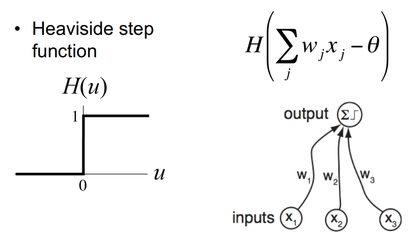
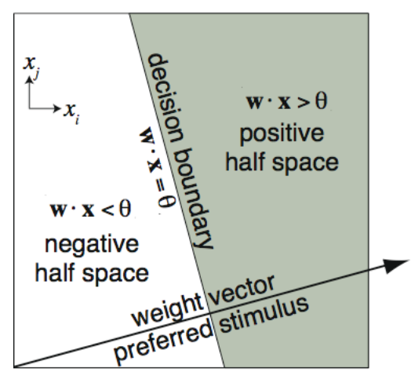
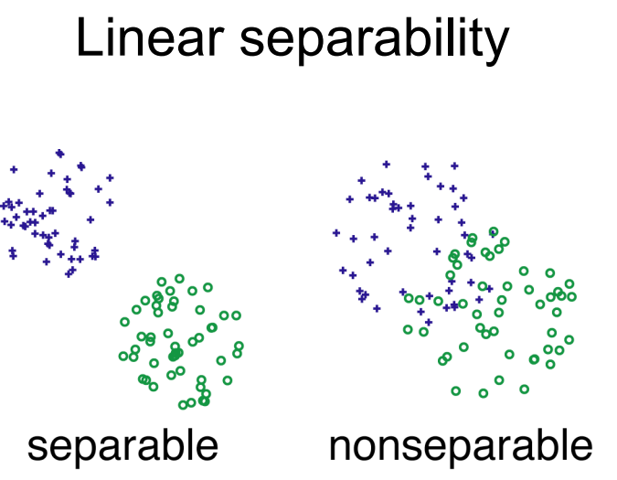
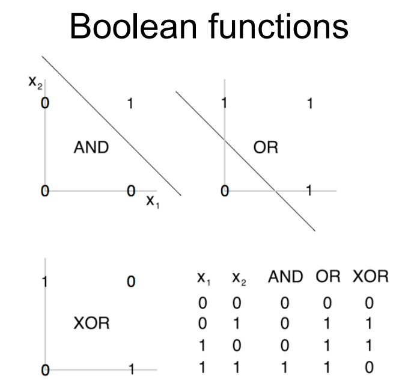

# Deep Learning

## Linear Threshold Neuron (LT Neuron)
1. Weigh the evidence
2. Compare with a threshold

- Conjunctions and disjunctions of N variables or their negations can be realized by an LT neuron. 
- An LT neuron cannot represent XOR, because inputs are nonseparable.

- Excitatory inputs: $ H(\sum_j^N x_j-\theta) $
	- Logical AND, "conjunction", highly selective, high threshold: $ \theta=n-0.5 $
	- Logical OR, "disjunction", indiscriminate, low threshold: $ \theta=0.5 $
	- Threshold controls selectivity
- Inhibitory inputs
- Inhibition as a dynamic threshold: $ H(\sum_j^n x_j-\sum_{j=n+1}^N x_j-\theta) $
- Inhibition as negation, "nonmonotonic conjunction": $ x_1 \wedge \bar{x}_2 \wedge x_3=H(x_1+\bar{x}_2+x_3-2.5)=H(x_1+1-x_2+x_3-2.5)=H(x_1-x_2+x_3-1.5) $

### Vector Notation
$ \bold{w}=(w_1,w_2,...,w_N) $
$ \bold{x}=(x_1,x_2,...,x_N) $
$ \bold{w}^T\bold{x}=\sum_{i=1}^Nw_ix_i $
$ H(\bold{w}^T\bold{x}-\theta) $

### Separating Hyperplane and Preferred Stimulus

- $w$ and $\theta$ define a hyperplane that divides the input space into half spaces. This hyperplane is called the “decision boundary.”
- Assuming positive threshold, the direction in input space along which minimal amplitude is needed for activation is the same as the direction of the weight vector. That is, an LT neuron "prefers" a stimulus in the same direction as its weight vector.

