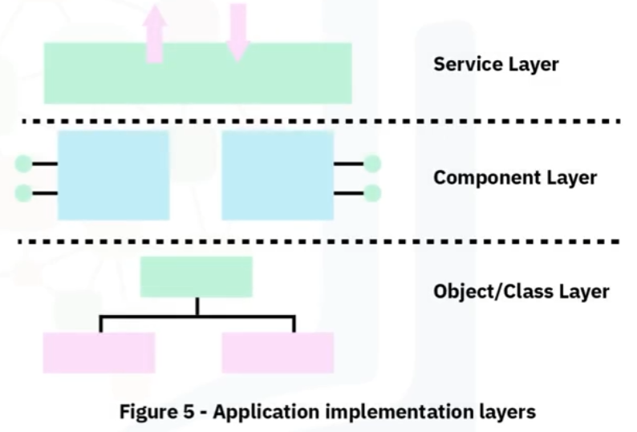

# Introduction to Software Engineering
Software engineering is the application of scientific principles to the design and creation of software. The field uses a systematic approach to collect and analyze business requirements in order to design, build and test software applications to satisfy those business requirements.

## Software Development Lifecycle (SDLC)
Software Development Lifecycle, known as the SDLC, is a systematic process to develop high-quality software in a predictable timeframe and budget. The goal of the SDLC is to produce software that meets a client's business requirements. The SDLC defines phases of the software development process that encompass their own process and deliverables. It's a cycle of planning, design, and development that can be implemented as an iterative approach to software development. Adherence to the SDLC minimizes risks and costs to the development of high-quality, deployable software.

There are key advantages in following the SDLC. The first advantage is that it gives development teams a process to follow rather than using an ad hoc approach to improve efficiency and reduce risks. Secondly, there are discrete phases to the SDLC. Each phase is well-defined so that team members know what they should be working on and when. It facilitates communication between the customer, other stakeholders and the development team. The SDLC offers an overview of the process, so stakeholders know where they fit in to that process. Also, since each phase is discrete, cross-domain teams know when they have completed their tasks and when development can move to the next phase.

The SDLC provides room for iteration where, at the end of a cycle, the process can circle back to incorporate additional requirements as needed. Problem solving is incorporated early in the cycle so problems are addressed in a timely fashion and can be addressed in the design phase rather than during coding. Finally, each team member has a well-defined role which reduces conflict and overlapping responsibilities.

There are generally 6 phases in the SDLC process, planning, design, development, testing, deployment, and maintenance. Each phase is discrete, meaning that tasks from a previous phase do not overlap with tasks in the next phase. Note that some organizations may have different names for each stage. For example, "planning" may be called "requirements" or "strategy" or "analysis." Also, some organizations may have additional or fewer stages.

### Phase 1: Planning
In the planning phase of the SDLC, requirements are gathered, analyzed, documented and prioritized. When planning a software solution, the following factors must be considered: uses of the solution, the overall purpose of the solution, data inputs and outputs, legal and regulatory compliance, risk identification, quality assurance requirements, allocation of human and financial resources, and project scheduling. As part of the planning phase, labor and material costs are estimated and weighed against time constraints. Also, project teams are identified, and roles of each team member are proposed.

If stakeholders are struggling to define requirements, often the development team may produce prototypes during the planning stage to tease out those requirements. A prototype is a small-scale replica of the end product used to get stakeholder feedback and establish requirements. A prototype is used to test basic design ideas. Though prototyping usually occurs during the planning stage, it can also occur at various phases of the SDLC whenever requirements need to be reconsidered or clarified as the project develops.

After requirements have been gathered, they are combined into a document called a software requirements specification, or SRS, document. The SRS needs to be clearly understood and approved by all stakeholders. The developers are also involved at this stage, so they can gain a clear understanding of these requirements.

### Phase 2: Design
In the design phase, the requirements gathered from the SRS are used to develop software architecture. Several team members work together at this stage to design the architecture. The architecture is reviewed by the stakeholders and team. During this phase, prototypes can be designed. A prototype is a preliminary mock-up of the system, or parts of the system, used for demonstration purposes. The document created in this phase is called a design document, and is used by developers during the next phase, which is the development phase.

### Phase 3: Development
The development phase, sometimes called the "building" phase or the "implementation" phase, is when the developers start the coding process once the design document is completed. The project planners use the design document to determine and assign coding tasks. This phase often requires the use of programming tools, different programming languages and software stacks. Organizations may also have standards or guidelines that need to be followed.

### Phase 4: Testing
The testing phase is next in the process once the coding is complete. Some large projects have dedicated testing teams. Code needs to be thoroughly tested to ensure it is stable, secure, and meets the requirements outlined in the SRS. Testing can be manual, automated, or a hybrid of both. Product bugs are reported, tracked and fixed, and code is retested until the software is stable.

Some common levels of testing include unit testing, integration testing, system testing and acceptance testing.

### Phase 5: Deployment
The deployment phase is where the application is released into the production environment and made available to users. This can also happen in stages. First, it is released onto a user acceptance testing, also called UAT, platform, and once the customer signs off on the functionality, it is released to production. This approach can be used for making software available on a website, mobile device app store, or a software distribution server on a corporate network.

### Phase 6: Maintenance
Finally, the maintenance phase happens once the code has been deployed into a production environment. This phase helps to find any other bugs, identify user interface issues, and identify other requirements that may not have been listed in the SRS. Code enhancement can also be identified at this stage. If bugs are discovered in this phase that were missed during testing, these errors may need to be fixed for high-priority issues or incorporated into the requirements as part of a future software release and the process can start over again.

## Building Quality Software
There are numerous processes that are common to software engineering projects.

### Requirements Gathering
The software requirements specification (SRS) encompasses the process of collecting and documenting the set of requirements that the software needs to adhere to. It may include a set of use cases that describe the business needs and user flows that the software must implement.

Software requirements can be classified into four broad categories:

1. Functional
2. External and user interface
3. System features
4. Nonfunctional

### Design
Software design is the process of transforming requirements into a structure that is implementable using code. The software design process translates the requirements into a language the developers can use to write the code. It transforms the requirements into a software solution. The technical lead breaks down requirements into sets of related components with clearly defined behaviors, boundaries and interactions. These components define the system architecture. The system design incorporates guidance on system functions, performance, security and platform characteristics. The design communicates business rules and application logic, application programming interface design, user interfaces and database design.

### Coding for Quality
Code quality refers to the characteristics of the code including attributes such as maintainability, readability, testability and security. Quality code must fulfill the intended requirements of the software without defects. Additionally, it should be clean and consistent, easy to read and maintain, well-documented, and efficient.

Coding for quality entails following a set of coding practices during development, including following coding standards, conventions, patterns and styles, using automated tools, known as linters, to detect programmatic and stylistic errors, and commenting in the code itself to make it easy for others to understand and modify.

### Testing
Software testing is the process of verifying that the software matches established requirements and is free of bugs. Its purpose is to identify errors, gaps, missing requirements when compared with stated requirements. Properly tested software ensures reliability, security, performance and efficiency. Software testing can often be automated or done manually.

Levels of testing include unit, integration, system and user acceptance. Unit testing is often done by the developer and tests the smallest component of code that can be isolated from the rest of the system. Once components are integrated into the large production, integration testing occurs. After the larger product is deemed completed, system testing can take place. User acceptance testing (UAT), sometimes called beta testing, is when the software is tested by the intended end users. Types of testing can broadly be divided into three categories, functional, non-functional and regression.

### Releases
When the newest version of the software is distributed, it is referred to as a "release." Different types of releases are intended for different audiences. There is generally an "alpha," a "beta" and a "GA" release. GA stands for general availability.

The alpha release is the first functioning version of the system released to a select group of stakeholders. The alpha release likely contains errors and may not contain the full feature set, but does contain most of the desired functionality. Design changes may still occur during this release stage.

The beta release, also called a limited release, is given to the stakeholders outside of the developing organization. One of the intents of the beta release is to try out the software under real conditions, test the functionality, and identify any outstanding bugs and errors. The beta release should meet all the functional requirements.

Then, after the beta release changes are agreed upon, made, and tested, and a stable version is released. The audience for the GA release is all users.

### Documenting
Software documentation should be provided to both non-technical end-users and technical users.

System documentation is geared towards the technical user. Technical users may be other engineers, developers, or architects. System documentation explains how the software operates or how to use it. It consists of README files, inline comments, architecture and design documents, verification information and maintenance guides.

User documentation is provided to the non-technical end-users to assist them in the user of the product. Generally, user documentation is provided in the form of user guides, instructional videos and manuals, online help, and inline help.

## Requirements
Requirement gathering is a six-step process of defining a problem to be solved and documenting how to go about solving the problem. These steps include:

1. Identifying stakeholders
2. Establishing goals and objectives
3. Eliciting requirements from the stakeholders
4. Documenting the requirements
5. Analyzing and confirming the requirements
6. Prioritizing

### Identifying Stakeholders
Generally, the stakeholders work for the organization that requests the development of the software product. Key personnel from the organization may include decision-makers, end-users, system administrators, engineering, marketing, sales and customer support personnel. It is good to have a representative from every group that the product affects.

### Establishing Goals and Objectives
The goals of the product should be clearly defined. Goals are broad, long-term achievable outcomes. Goals can include customer outcomes and business goals.

Next, objectives should be identified. Objectives are more specific than goals, and they are actionable and measurable actions that achieve the stated goals.

### Eliciting, Documenting and Confirming
The next three steps, eliciting, documenting and requirement confirmation are usually completed iteratively. Elicitation can be accomplished through surveys, questionnaires and interviews. As the requirements emerge, they should be documented and checked to ensure they align with the goals and objectives. Documented requirements should be easily understood by stakeholders and the project team. In order to confirm the requirements, they should be analyzed to ensure consistency, clarity and completeness. After the analysis, the requirements should be shared with and approved by stakeholders. 

### Prioritizing
After confirmation, requirements should be prioritized. Labels such as "must-haves," "highly desired" and "nice-to-have" are helpful. If possible, order the requirements within those categories.

### Requirements Documentation
Typically, there may be three documents that result from the requirements gathering process:

1. Software requirements specification (SRS)
2. User requirements specification (URS)
3. System requirements specification (SysRS)

The most common of these is the **software requirements specification**. It is a document that captures the functionalities that the software should perform and also establishes benchmarks or service levels for its performance. Parts of an SRS include:

1. A purpose statement that contains the intended use of the SRS, its audience and scope. The product's purpose describes who will have access to the SRS and how they should use it. The scope defines the benefits of the software, its goals, and objectives.
2. Constraints, assumptions and dependencies
	- **Constraints** describe how the product must operate under given conditions that may limit options in the design phase such as confirmation to standards or hardware limitations.
	- **Assumptions** may include things like a required operating system or hardware that is needed by the software to function.
	- **Dependencies** on other software products should also be noted.
3. Requirements
	1. **Functional requirements** are those that cover the functionalities of the software.
	2. **External requirements** are those that address the behavior of the software in relation to external entities such as users and interactions with other hardware or software.
	3. **System features** are a subset of functional requirements that are required features for the system to function.
	4. **Non-functional requirements** include specifying performance, safety, security and quality standards.

**User requirements specification (URS)** describes the business need and expectations of the end-users from the software system. The user requirements are written as "user stories" or "use cases" that answer three questions:

1. Who is the user?
2. What is the function that needs to be performed?
3. Why does the user want this functionality?

User acceptance testing determines if these requirements have been met. Often though, the user requirements are software requirements are combined into a single SRS document. The SRS details the expectations of the software system.

The system requirements specification (SysRS) clearly outlines the requirements of an entire system. The system requirements specification is often used interchangeably with software requirement specification, but the SysRS is actually broader in scope than the SRS. Many software projects develop an SRS rather than a SysRS.

The SysRS contains system capabilities, interfaces and user characteristics, as well as requirements on policy, regulation, personnel, performance, security and system acceptance criteria, and hardware expectations. 

## Software Development Methodologies
A specific methodology for developing software is commonly used in order to assist the development team to clarify communication among team members and determine how and when the information is shared. 

### Waterfall Model
In the beginning, when the SDLC was conceived, it implemented what is known as the waterfall method. Waterfall is a sequential method of software development where the output of one phase is the input of the next phase of the cycle. Development and work on the next phase start only after the completion of the previous phase. All planning, such as defining requirements and architectural design, is done upfront. The customer usually doesn't see the product until it is in the testing phase. For a major version release of the product, the same process is repeated resulting in long intervals, such as years, between releases.

### V-Shape Model
The V-shape model is named as such because the phases form the shape of a V. The phases going down the left side of the V are called "verification." Then, going up the right side of the V, those phases are called, "validation." The V-shape model is like waterfall in that it is also sequential. Each phase in verification corresponds with a validation phase. There are four stages that occur on each side of the V. Going down the V are planning, system design, architecture design and module design. The bottom of the V is the coding phase. And going back up the V are the four phases that correspond to the phases going down the V, unit testing, integration testing, system testing and acceptance testing. The tests are written during the verification phases on the left and executed during the validation stages on the right.

### Agile Model
The agile model focuses on a collaborative software development process over multiple short cycles rather than a strictly top-down linear process. Agile is called an iterative approach to development. It still aligns with the SDLC, but each phase is short. Teams work in cycles, or sprints, which are usually one to four weeks long. Unit test happens in each sprint to minimize the risk of failure. Rather than the "maintenance" stage of the SDLC, the final stage of the sprint is a feedback stage.

At the end of each sprint, a chunk of working code is released at a meeting called the "sprint demo" where stakeholders can see the new functionality and provide feedback. After the sprint demo, the entire process is repeated for every sprint cycle. After several sprint cycles, a minimum viable product, or MVP, is developed so stakeholders can provide feedbacks on the basic feature set. The MVP contains a feature set to validate assumptions about the software. The four core values of agile development outlined in the "agile manifesto" are:

1. Individuals and interactions over processes and tools
2. Working software over comprehensive documentation
3. Customer collaboration over contract negotiation
4. Responding to change over following a plan

The main difference between traditional models such as waterfall and V-shape model and the agile model is that the former is sequential whereas the latter is cyclical. Traditional SDLC models center around the whole product being developed before soliciting customer feedback, whereas agile focuses on quick, short bursts of development.

There are pros and cons to each method, though agile is probably the most popular method used in modern software development. For example, budgeting and resource allocation is challenging under the agile model, and the overall scope of the product is not clearly defined.

## Software Versions
Software versions tell us a lot about programs and applications. Developers can provide useful information with version numbers. Most version numbers follow a similar format and represent similar information. Version numbers indicate when the software was released, when it was updated, and if any minor changes or fixes were made to the software. Software versioning is how software developers keep track of new software, updates and patches for programs and applications.

Version numbers can be with one to four sets, each divided by a period. An application with a 1.0 version number most commonly indicates the first release. A version still in beta or testing could have a version number lower than 1, such as 0.9.

Lack of compatibility between old and new versions of software is a common problem. A backward-compatible software functions properly with older versions of files, programs and systems. 

## Software Testing
Software testing is the practice of integrating quality checks throughout the software development cycle. The purpose of testing is to check whether the software matches expected requirements and ensure error-free software. In order to test software, the team writes "test cases" to verify the functionality of a software application and ensure requirements have been satisfied. Test cases can be written in different stages of the SDLC and may vary depending on the type of test or the method used to develop the software, such as agile or waterfall.

A test contains steps, inputs, data and expected outputs. Regardless of the test type or development method, test cases should always be written after requirements are finalized. Software testing helps evaluate whether the software product meets requirements and is error-free. Software testing can be broadly classified into three categories, functional testing, non-functional testing and regression testing.

### Functional Testing
Functional testing usually involves black-box testing, which is a method of testing without looking at source code or internal structure. It concerns only with inputs and corresponding outputs of the system under test (SUT). It is entirely based on testing functional requirements. It can be carried out manually or through automated tools.

The goal is to test the functionality of the application making sure the application is usable and accessible. Functional testing makes sure that when user errors or input edge cases do occur, the software handles those exceptions seamlessly by displaying appropriate error messages.

### Non-functional Testing
Non-functional testing includes testing the application for attributes like performance, security, scalability and availability. It should answer questions like the following:

- How does the application behave under stress?
- What happens when many users log in at the same time?
- Are the instructions in documents and user manuals consistent with application behavior?
- How does the application behave under different operating systems?

### Regression Testing
Regression testing, also called maintenance testing, confirms that a recent change to the application, such as a bug fix, does not adversely affect already existing functionality. Regression test case selection and prioritization can be challenging and depend on several factors. Common regression test cases include:

- Frequent defects
- Frequently used functionality
- Features with recent changes
- Complex cases
- Edge cases
- Randomly successful or failed cases

### Testing Levels
There are four testing levels, unit, integration, system and acceptance. Each level occurs at a different time in the SDLC. These levels are designed to prevent overlap and thus reduce the time spent on testing.

### Unit Test
Unit test refers to tests that verify the functionality of a specific section of code, usually at the function level. It is performed by the software developer or engineer during the development phase of the SDLC. It aims to eliminate construction errors before code is integrated with other modules.

### Integration Test
Integration test seeks to identify errors when two or more smaller, independent code modules are combined. Integration testing is another type of black-box testing. Prior to integration testing, smaller, independent code modules that passed unit testing are incorporated into the larger software application. Integration testing exposes bugs that occur when those smaller units of code interact with each other. Integration testing uncovers deficiencies in communication with a new module in conjunction with other exiting modules, databases or external hardware. Also, sometimes during module development, requirements change and the module isn't fully unit-tested. Poor exception handling can cause problems when modules are integrated together. 

### System Testing
System testing occurs after integration testing and is conducted on a complete, integrated system to evaluate the system's compliance with its specified requirements. It validates the system as a fully completed software product. System test is both functional and non-functional. System testing is done in a staging environment, which should be similar to the production environment.

### Acceptance Testing
Acceptance testing is formal testing with respect to user needs, requirements and business processes. It determines whether a system satisfies the needs of the users, customers and other stakeholders. Acceptance testing is usually done by the customer or the stakeholders during the maintenance stage of the SDLC.

## Software Documentation
Software documentation is information about the software that describes what the product is and how to use it. These can be written assets, video assets and/or graphical assets associated with a software product's development and use. Documentation is an essential aspect of software engineering applicable across all the phases of SDLC.

Documentation can be divided to two categories, product documentation and process documentation. Product documentation relates to the product's functionality, whereas process documentation describes how to complete a task. Process documentation should provide the requirements for the quality implementation of a business process.

Product documentation includes five categories, namely requirements, design, technical, QA and user documentation.

### Requirements Documentation
Requirements documentation is written during the planning phase of the SDLC and is intended for the development team including developers, architects and QA personnel. It describes the expected features and functionality of the software system. It includes the software requirements specifications, system requirement specifications and user acceptance specifications.

### Design Documentation
Design documentation is written by the software architects and the development team to explain how the software will be built to meet the requirements. It consists of both conceptual and technical design documents.

### Technical Documentation
Technical documentation includes comments written in the code to help other developers read the code to understand its behavior. It also may include working papers that explain how the code works and documents that record engineers' ideas and thoughts during project implementation.

### Quality Assurance Documentation
QA documentation includes all documents that pertain to a testing team's strategy, progress and metrics. Types of test documentation include test plans, test data, test scenarios, test cases, test strategies and traceability matrices. Traceability matrices map test cases to their requirements.

### User Documentation
User documentation is intended for end-users and explains how to operate the software or help them to install or troubleshoot the system. End-user documentation includes frequently asked questions, installation and help guides, tutorials and user manuals.

### Standard Operating Procedures (SOPs)
Standard operating procedures, called SOPs, often accompany process documentation. Process documentation provides an overview of a process, but SOPs go through much greater detail. The SOP is written documentation that explains step-by-step how to accomplish a common yet complex task that is organization specific. For example, checking in code using a code repository is common knowledge for a software engineer. However, an organization may have specific steps to follow in order to get code merged into the main branch. SOPs can be in the form of a flowchart, hierarchical outline, or step-by-step instructions.

### Summary
With regards to the software development and the SDLC, updating documentation happens during the maintenance phase. Ideally, documentation should also be reviewed periodically to ensure its accuracy.

## Roles in Software Engineering Projects
There are several common roles on a software development project. And these roles can have different names depending on the approach being used, such as agile or waterfall. Not all projects will have all these roles. The roles include project manager or scrum master, stakeholder, system or software architect, UX designer, software developer, tester or QA engineer, site reliability or ops engineer, product manager or product owner, and technical writer or information developer.

### Project Manager / Scrum Master
Traditional SDLC methods have project managers, but in agile, the equivalent role is called a scrum master. A project manager makes sure that the project runs smoothly and facilitates communication about the project. The project manager often deals with bigger picture issues such as

- Planning, scheduling and budgeting
- Allocation personnel and resources
- Executing the software plan
- Team communication

In agile, there is a scrum master. Rather than focusing on planning, the scrum master focuses on ensuring team and individual success. Remember that the four core agile values prioritize people and communication over process, and the scrum master is responsible for facilitating that communication.

### Stakeholder
The stakeholders are the people for whom the product is being designed. They include individuals such as the customer, end-users, decision-makers, system administrators and other key personnel. The stakeholder is mainly responsible for defining product requirements and providing feedback if the team members need clarification on requirements or if a proposed solution cannot be solved as planned. The stakeholder may also participate in beta testing and acceptance testing before the software is released.

### System Architect
The system architect designs and describes the architecture of a project as well as communicates that architecture to team members. They are also called a software architect or a solution architect. They are responsible for designing the essential characteristics of the inner structure and technical aspects of the software. The architect provides technical support across the different stages of the SDLC.

### UX Designer
The goal of a UX designer is to balance making the software intuitive but also as robust as it needs to be to address requirements. They define how the software behaves from the user's perspective. The UX designer determines how the software communicates its functionality to the end-user and how the end-user interacts with it.

### Developer
The developers write the code that powers the software. Responsibilities include implementing the architecture laid out in the design document, incorporating the requirements laid out in the software requirements specification, and employing the UX requirements determined by the UX designers.

### Testers / QA Engineer
Testers or QA engineers are in charge of ensuring the quality of the product and that the software solution meets customer requirements. They are responsible for writing and executing test cases to identify bugs or deficiencies and provide this feedback to the development teams.

### Site Reliability Engineer
A site reliability engineer, sometimes called an SRE or ops engineer, bridges development and operations by combining software engineering expertise with IT systems management. They track incidents and facilitate meetings to discuss them. They also automate systems, procedures and processes, assist with troubleshooting, and ensure reliability for the customer.

### Product Manager / Product Owner
The product manager or the product owner has the vision of what the product should look like. They have an intimate understanding of the client's requirements and the end-user's need. They are responsible for leading development efforts to create the software and for ensuring the product provides value that stakeholders are looking for.

### Technical Writer / Information Developer
The technical writer or information developer writes documentation for the end-user. They write documentation on technical material geared towards a non-technical audience. Not only does this documentation help the end-user to use the software, but it also helps the customer so they can provide timely feedback to the development teams. Technical writers may be asked to write user manuals, reports, white papers and press releases.

# Introduction to Software Architecture and Design
Software architecture design takes place during the design phase of the SDLC. Software architecture, simply put, is the organization of the system. It serves as a blueprint for the software system that the programmers use to develop the interacting components of the software. The architecture comprises the fundamental structures of a software system and explains the behavior of that system.

The architecture defines how components should interact with each other, the operating environment, and the principles used to design the software. The software architecture captures early design decisions that are often costly to change once implemented. It also addresses non-functional aspects of the application such as performance, scalability, maintainability, interoperability, security and manageability.

Architecture design also guides the choice of technology stacks used for the system. Recall that a tech stack is a list of all the technologies including software, programming languages, libraries and frameworks that will be used to create the system.

### Artifacts
Much like blueprints communicate design decisions to the builders of a house, there are also several artifacts produced during the architecture design phase that are used to communicate the software design to the stakeholders. These artifacts include a software design document (SDD), an architectural diagram and unified modeling language (UML) diagrams.

The SDD is a collection of technical specifications that indicate how the design should be implemented. It provides a functional description of the software and design considerations such as assumptions, dependencies, constraints, requirements, objectives and methodologies.

The architectural diagram displays components, their interactions, their constraints and their confines. It displays the architectural patterns used in the design. Architectural patterns are general, reusable solutions to commonly occurring problems.

Unified Modeling Language (UML) diagrams communicate structure and behavior using common programming language agnostic notation.

The architecture drives choices about the environment in which the software is released. The production environment is comprises of the infrastructure that runs and delivers the application to the end-user such as the servers, load balancers and databases.

### Software Design
Software design is a process during which structural components and behavioral attributes of the software are documented before it can be developed. One of the key activities of the design process is modeling the software to express its design. This involves creating visual or diagrammatic representations of the bigger software solution and its sub-components, as well as the interactions between them. This can be done using simple flowcharts or more standardized methods like UML.

A software can be construed in terms of structural elements. Structural design conceptualizes a software problem into well-organized smaller solution elements called modules and sub-modules. Structured design stresses organization in order to achieve a solution. A well-structured design should contain modules that are cohesive and loosely coupled.

### Behavioral Models
Behavioral models describe what a system does, without explaining how it does it. The overall behavioral of a system can be communicated through behavioral models. There are a number of different UML diagrams that can be used to communicate the behaviors of a system, such as a state transition diagram and an interaction diagram.

When developing a complex software system with interconnected modules, it can be difficult to remember the relationships, behaviors and hierarchies among different elements. UML is a way to visually represent the architecture, design and implementation of complex software systems. UML is a standardized modeling language that can be used throughout development processes. UML can be divided into to categories, structural or behavioral.

The biggest advantage of UML diagrams is that they allow you to plan out features before any coding takes place, which saves time and money. Second, the diagrams can be used to bring new team members and developers switching teams to get up to speed quickly. Also, the diagram can facilitate the communication between technical and non-technical audiences more easily. Finally, having a visual representation of the system allows developers to navigate the source code because they can see the relationships among modules. 

A state transition diagram is a collection of states and events that describe the different states that a system has and the events which cause a change of state in the system.

An interaction diagram is used to model the dynamic nature of a software system. They help visualize objects and their relationships. A sequence diagram is a type of interaction diagrams.

### Objects
Object-oriented analysis and design (OOAD) is an approach for analyzing and designing the system when the system requires object-oriented programming languages to be developed. In object-oriented programming languages, the generic version of an object is called a class. 

OOAD is used for a system that can be broken down into objects that interact with each other. In this way, multiple developers can work on different aspects of the application at the same time.

### Components
A component is an individual unit of encapsulated functionality that serves as a part of an application in conjunction with other components. There are six characteristics of components.

1. Reusable: implies that components should be designed so as to be reused in different applications.
2. Replaceable: means that a component should be easily replaced with another component.
3. Independent: means the component should be designed so it doesn't have dependencies on other components.
4. Extensible: entails the ability to add behavior to a component without changing other components.
5. Encapsulated: consists of bundling a component's data and methods to hide its internal state, so it doesn't expose its specific implementation.
6. Non-context specific: involves designing it so that it operates in different environments.

An API can be packaged as a component, if it can be reused across multiple systems and applications. For instance, a component could be an open-source API that connects a system to a particular database.

A component can also be the interface for a database, called a data access object, that switches the user to a different database without the application knowing about the switch.

A controller is a type of component that determines which other components need to be called for a particular event. It controls the flow of data between two other components.

Component-based architecture focuses on the decomposition of the design into these logical components. It provides a higher level of abstraction than object-oriented designs A component-based architecture should define, compose and implement loosely coupled, independent components so they work together to create an application.

### Services
A service is like a component, also a unit of functionality, but it is designed to be deployed independently and reused by multiple systems. A service focuses on a solution to a business need. A key difference between a component and a service is that a service will only have one unique, always running instance with whom multiple clients communicate. The diagram below indicates the relationship between objects, components and services in a layered architecture.

A service is a type of component. It is meant to be deployed independently of the overall system. Example of services include:

- Checking a customer's credit
- Calculating a monthly loan payment
- Processing a mortgage application

In a service oriented architecture (SOA), services are loosely coupled and interfaced with each other via a communication protocol over a network. SOA supports building distributed systems that deliver services to other applications through the communication protocol.

### Distributed Systems
A distributed system is a system with multiple services located on different machines that coordinate interactions by passing messages to each other via a communication protocol such as hypertext transfer protocol (HTTP). Even though the services on a distributed system operate on multiple machines, it appears to the end-user as a single coherent system.

A distributed system shares resources such as hardware, software and data. They are fault-tolerant, meaning if a node or a service fails, the system continues to run and may change during execution without service interruption. Multiple services run concurrently on a distributed system, reducing latency and increasing throughput. They are also scalable as the number of users increases. The computers running the distributed system do not need to use the same kind of hardware, operating systems or programming languages.

A node is any device on a network that can recognize, process and transmit data to other nodes on the network. A distributed system consists of multiple interconnected nodes where the nodes are running one or more services in an SOA. 

Distributed systems generally use one or more of the following basic types of architecture: client-server, three-tier, peer-to-peer or micro-sevices.

## Software Architectures
An architectural pattern is a repeatable solution to a problem in software architecture. Patterns highlight common internal elements and structures of a software system. 

### Two-Tier
A two-tier architecture, also called client-server, is a computing model in which the server hosts, delivers and manages most of the resources and services delivered to the client. The interface resides on the client machine and makes requests to a server for data or services. This type of architecture usually has more than one client computer connected to a server component over a network connection.

A text messaging app is an example of a two-tier pattern. The client initiates a request to send a text message through a server and the server responds by sending that message to another different client. Another example is database clients connecting wit database servers.

### Three-Tier
A three-tier architecture is the most common software architecture. It is composed of several horizontal tiers that function together as a single unit of software. A tier only communicates with other tiers located above or below it. Related components are placed within the same tier. Changes in one tier do not affect the other tiers. The three-tier architecture organizes applications into three logical and physical computing tiers, the presentation tier, or user interface, the middle tier called presentation tier, where business logic is processed, and the data tier, where the data is stored and managed.

Many web apps are examples of three-tier patterns. They use a web server to provide the user interface, an application server to process user inputs, and a database server that handles data management.

### Peer-to-Peer
The peer-to-peer (P2P) architecture consists of a decentralized network of nodes that are both clients and servers. The workload is partitioned among these nodes. Peers make a portion of their resources directly available to other network participants, without the need for central coordination by servers. Resources are things like processing power, disk storage or network bandwidth. Peers both supply and consume resources, in contrast to the traditional client-server architecture in which the consumption happens strictly by the client and the servers supply the resources. Peer-to-peer architecture is useful for file sharing, instant messaging, collaboration and high-performance computing.

Cryptocurrencies such as Bitcoin and Ethereum use a peer-to-peer pattern. Each computer in the blockchain acts as both a server and a client.

### Event-Driven
An event is anything that results in a change of state. An event can be thought of as an action that is triggered by the end-user, such as a mouse click or another part of the program. Event-driven architecture focuses on producers and consumers of events. Producers listen for and react to triggers while consumers process an event. The producer publishes the event to an event router, which determines which consumer to push the event to. The triggering event generates a message, called an event notification, to the consumer, which is listening for the event. The components in event-driven architectures are loosely coupled making the pattern appropriate for use with modern, distributed systems.

Ride-sharing apps such as Uber and Lyft are examples of event-driven patterns. The customer sends a notification that they need a ride from a particular location to another location, and that event is routed to a driver.

### Microservices
Microservices are an approach to building an application that breaks its functionality into modular components called services. An API is part of an application that communicates with other applications. An API defines how two applications share and modify each other's data. API can be used to create a microservices-based architecture. The API gateway routes the API from the client to a service. An orchestration handles communication between services.

Social media sites are examples of micro-services. A user account can request different services such as adding friends, targeted and recommendation, and displaying contents.

### Combining Patterns
Architectural patterns are not necessarily mutually exclusive. Two or more of these patterns can be combined. For instance, a three-tier architecture can also be micoservice-based, or a peer-to-peer architecture can also be event-driven. However, not all architectural patterns can be used in conjunction with others. A peer-to-peer cannot also be two-tier because a single machine in a peer-to-peer architecture represents both a client and a server whereas a two-tier architecture separates the client from the server. It is up to the system architect to determine which architectural patterns the software system should adhere to.

## Application Deployment Environments
An application environment is a combination of the hardware and software resources required to run an application. It includes the application cod and/or binary executables for its various components or modules, the software stack it requires to run the application such as modules and libraries it depends on, third party applications and middleware, and the operating system, any networking components and infrastructure, as well as any physical or virtual hardware including computing or processing resources, memory, and storage.

There are a variety of environment types depending on the application's storage in the lifecycle.

### Pre-Production Environments
The pre-production environments are thosee platforms that the application resides on in various forms as it gets prepared for production. Common pre-production environments are development, QA and staging.

The development environment is the platform on which the application is being actively coded, and in many cases it may just be the developer's workstation.

The QA environment, sometimes called testing environment, is the environment that allows the QA team to test the application's components.

The staging environment is the environment that is as close to replicating the production environment as possible but is not meant for the general users.

### Production Environments
The production environment includes the entire solution stack consisting of both hardware and software on which the application runs as additional infrastructure components. The production environment is intended for all users. Unlike the pre-production environments, this robust environment must take the application load into consideration because it's intended for general use, possibly by thousands or millions of people at the same time for enterprise-level applications.

 Production environments must also take into account non-functional requirements such as security, reliability and scalability.
 
### Production Environment Infrastructure
There are several options for deploying application environments. 

In on-premise deployment, the system and its infrastructure reside in-house, within the organization's physical location, often behind a firewall. Firewalls prevent unauthorized access to or from a private network. If an organization desires greater security or control of an application and the data in use by that application, it may deploy the application on-premises. For on-premises software deployments, an organization is responsible for the system, hardware, related infrastructure and maintenance required to run the application. On-premises deployment is usually more expensive  when compared to cloud deployment.

There are three types of cloud deployment models, public, private and hybrid.

The public cloud is when you leverage the software's supporting infrastructure over the open internet on hardware owned by the cloud provider. That hardware and the associated services are shared with other companies. Public cloud providers include Amazon Web Services (AWS), Microsoft Azure, Google Cloud Platform (GCP) and IBM cloud. The public cloud is the most common due to its scalability and cost.

With a private cloud, the cloud infrastructure is provisioned for exclusive use by a single organization. The software system can be run on-premises, or the infrastructure could be owned, managed and operated by a service provider. For example, AWS is also a private cloud service provider. The main advantage of a private cloud is increased security, but it also allows for more flexibility because it can be fully customized.

A mix of public and private clouds, working together seamlessly, is called a hybrid cloud model. A hybrid cloud potentially optimizes the advantages of both public and private cloud models with regard to cost, security, scalability and flexibility.

### Production Deployment Infrastructure and Components
Let's consider an n-tier architecture required to deploy an application in a production environment. The top tier is the presentation tier, which contains the front-end client applications. All other tiers are located behind a firewall. The next tier is the web tier, which has a web load balancer that distributes incoming traffic to several web servers. The tier below the web tier is the application server tier, which contains an app load balancer or a proxy server that routes traffic to different application servers. The bottom tier is the data tier, which contains the database server with a high availability replica to ensure reliability.

#### Firewalls
A firewall is a security device that monitors traffic between networks. It permits or blocks requested data based on a set of security rules. It acts as a barrier between networks to block viruses, malware and hackers from accessing the internal network.

#### Load Balancers
The purpose of load balancer is to distribute network traffic efficiently amongst multiple servers, called a server farm, on a network. Load balancers are used to prevent server traffic overload and are located between clients and the servers. A load balancer determines which servers are capable of fulfilling those requirements in a manner that maximizes availability and responsiveness. Load balancers ensure that no one server is overworked. They manage concurrent requests from clients and return the correct data in a fast and reliable manner.

#### Web and Application Servers
Web and application servers are either software or machines that provides services, resources, data or application to another computer program, called the client. Servers store, process, and manage network data, devices and systems.

A web server delivers contents such as web pages, files, images and videos to a client. It primarily responds to hypertext transfer protocol requests coming from a web browser such as a user accessing a website.

An app server is a server that runs business logic and provides the application to the client rather than the client running the app on their own machine. Its primary job is to enable interaction between the end-user and the server-side application code. The application code represents the business logic that determines how data can be created, stored and changed. And that logic dictates things like transaction results and what data is written to and retrieved from a database.

#### Proxy Servers
A proxy server is an intermediate server that sits between and handles requests between two tiers. A proxy server can serve multiple purposes such as load balancing, system optimization, caching, acting as a firewall, obscuring the source of the request, encryption, scanning for malware, and more. A proxy server can improve the efficiency, privacy and security of data flowing through a network. 

#### Databases and Database Servers
A database is a collection of related data, stored on a computer that can be accessed in various ways. A database is usually controlled by software called a database management system (DBMS). The DBMS controls a database by connecting the database to users or other programs. The database server controls the flow and storage of data. The DBMS connects the database server to an application so data stored in the database can be retrieved or manipulated by the application.